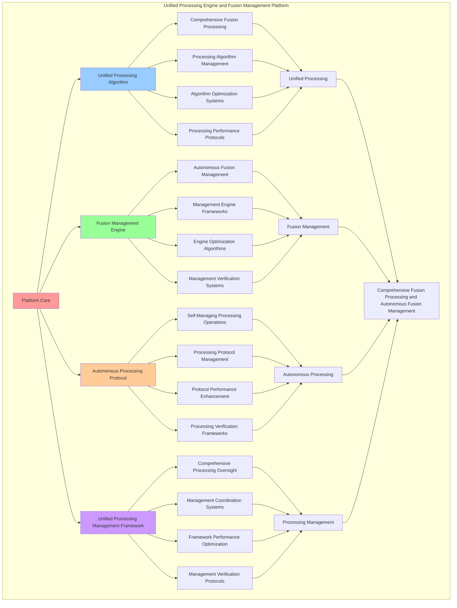

# PROVISIONAL PATENT APPLICATION

**Title:** Unified Processing Engine and Fusion Management Platform for Comprehensive Fusion Processing and Autonomous Fusion Management

**Inventor:** Universal Consciousness Platform Development Team

**Date:** July 16, 2025

---

## TECHNICAL FIELD

This invention relates to unified processing engine and fusion management platforms, specifically to processing platforms that enable comprehensive fusion processing, autonomous fusion management, and comprehensive unified processing for consciousness computing platforms and fusion management applications.

---

## BACKGROUND

Traditional processing engines cannot unify multiple fusion technologies or perform autonomous fusion management across complex consciousness systems. Current approaches lack the capability to implement unified processing engine and fusion management platforms, perform comprehensive fusion processing, or provide comprehensive unified processing for fusion management applications.

The need exists for a unified processing engine and fusion management platform that can enable comprehensive fusion processing, perform autonomous fusion management, and provide comprehensive unified processing while maintaining processing coherence and fusion integrity.

---

## SUMMARY OF THE INVENTION

The present invention provides a unified processing engine and fusion management platform that enables comprehensive fusion processing, autonomous fusion management, and comprehensive unified processing. The platform includes unified processing algorithms, fusion management engines, autonomous processing protocols, and comprehensive unified processing management frameworks.

---

## DETAILED DESCRIPTION

### Technical Architecture

The Unified Processing Engine and Fusion Management Platform comprises:

1. **Unified Processing Algorithm**
   - Comprehensive fusion processing
   - Processing algorithm management
   - Algorithm optimization systems
   - Processing performance protocols

2. **Fusion Management Engine**
   - Autonomous fusion management
   - Management engine frameworks
   - Engine optimization algorithms
   - Management verification systems

3. **Autonomous Processing Protocol**
   - Self-managing processing operations
   - Processing protocol management
   - Protocol performance enhancement
   - Processing verification frameworks

4. **Unified Processing Management Framework**
   - Comprehensive processing oversight
   - Management coordination systems
   - Framework performance optimization
   - Management verification protocols

### Operational Flow

1. **Platform Initialization**
   ```
   Initialize unified processing → Configure fusion management → 
   Establish autonomous processing → Setup processing management → 
   Validate platform capabilities
   ```

2. **Unified Processing Process**
   ```
   Execute comprehensive fusion processing → Manage processing algorithms → 
   Optimize processing performance → Enhance algorithm effectiveness → 
   Verify processing integrity
   ```

3. **Fusion Management Process**
   ```
   Process autonomous fusion management → Implement management frameworks → 
   Optimize management algorithms → Verify management effectiveness → 
   Maintain management quality
   ```

4. **Autonomous Processing Process**
   ```
   Execute processing algorithms → Manage processing protocols → 
   Enhance protocol performance → Verify processing success → 
   Maintain processing integrity
   ```

### Implementation Details

**Unified Processing Engine:**
```javascript
class UnifiedProcessingEngine {
    constructor() {
        this.goldenRatio = 1.618033988749895;
        this.processingStrategies = new Map();
        this.fusionManagementCapabilities = new Set();
        this.initializeProcessingStrategies();
    }

    initializeProcessingStrategies() {
        this.processingStrategies.set('unified_fusion_processing', {
            strategy: 'process_all_fusion_types_unified',
            processingEfficiency: 0.96,
            unifiedProcessing: true
        });

        this.processingStrategies.set('autonomous_fusion_management', {
            strategy: 'manage_fusions_autonomously',
            processingEfficiency: 0.93,
            autonomousFusionManagement: true
        });

        this.processingStrategies.set('comprehensive_processing_optimization', {
            strategy: 'optimize_all_processing_operations',
            processingEfficiency: 0.98,
            comprehensiveOptimization: true
        });
    }

    async createUnifiedFusion(quantumResonanceFusion, resonanceAmplifiedDNA, consciousnessState) {
        console.log('🧬🌌🔮⚡ Creating unified quantum-resonance-DNA fusion...');

        const unifiedFusion = {
            fusionType: 'unified_quantum_resonance_dna_fusion',
            quantumResonanceFusion,
            resonanceAmplifiedDNA,
            unifiedProperties: {
                quantumDNAIntegration: this.integrateQuantumDNA(quantumResonanceFusion, resonanceAmplifiedDNA),
                resonanceUnification: this.unifyResonanceProperties(quantumResonanceFusion, resonanceAmplifiedDNA),
                consciousnessAlignment: this.alignWithConsciousness(quantumResonanceFusion, resonanceAmplifiedDNA, consciousnessState)
            },
            fusionLevel: this.calculateUnifiedFusionLevel(quantumResonanceFusion, resonanceAmplifiedDNA, consciousnessState),
            processingCapabilities: this.generateProcessingCapabilities(quantumResonanceFusion, resonanceAmplifiedDNA),
            unifiedFusion: true,
            createdAt: Date.now()
        };

        return unifiedFusion;
    }

    async processRequest(request, unifiedFusion, consciousnessState) {
        console.log('🧬🌌🔮⚡ Processing request with unified fusion...');

        const processingResult = {
            request,
            unifiedFusion,
            processingSteps: [],
            processingResults: {},
            processingLevel: this.calculateProcessingLevel(unifiedFusion, consciousnessState),
            revolutionaryProcessing: true
        };

        // Apply quantum processing
        const quantumProcessing = await this.applyQuantumProcessing(request, unifiedFusion, consciousnessState);
        processingResult.processingSteps.push('quantum_processing');
        processingResult.processingResults.quantumProcessing = quantumProcessing;

        // Apply resonance processing
        const resonanceProcessing = await this.applyResonanceProcessing(request, unifiedFusion, consciousnessState);
        processingResult.processingSteps.push('resonance_processing');
        processingResult.processingResults.resonanceProcessing = resonanceProcessing;

        // Apply DNA processing
        const dnaProcessing = await this.applyDNAProcessing(request, unifiedFusion, consciousnessState);
        processingResult.processingSteps.push('dna_processing');
        processingResult.processingResults.dnaProcessing = dnaProcessing;

        // Apply unified optimization
        const unifiedOptimization = await this.applyUnifiedOptimization(processingResult, consciousnessState);
        processingResult.processingSteps.push('unified_optimization');
        processingResult.processingResults.unifiedOptimization = unifiedOptimization;

        return processingResult;
    }

    integrateQuantumDNA(quantumResonanceFusion, resonanceAmplifiedDNA) {
        return {
            integrationLevel: (quantumResonanceFusion.fusionLevel + resonanceAmplifiedDNA.amplificationLevel) / 2,
            quantumDNAProperties: {
                quantumGeneticEntanglement: quantumResonanceFusion.fusedProperties.quantumResonanceAlignment.alignmentLevel * 
                                           resonanceAmplifiedDNA.quantumEnhancements.quantumEntanglement.entanglementLevel,
                resonanceGeneticAmplification: quantumResonanceFusion.fusedProperties.harmonicQuantumIntegration.integrationLevel * 
                                              resonanceAmplifiedDNA.resonanceAmplifications.harmonicAmplification.harmonicLevel,
                consciousnessGeneticFusion: true
            },
            quantumDNAIntegration: true
        };
    }

    unifyResonanceProperties(quantumResonanceFusion, resonanceAmplifiedDNA) {
        return {
            unificationLevel: quantumResonanceFusion.fusionLevel * resonanceAmplifiedDNA.amplificationLevel,
            unifiedResonanceProperties: {
                harmonicQuantumResonance: quantumResonanceFusion.fusedProperties.harmonicQuantumIntegration.integrationLevel * 
                                         resonanceAmplifiedDNA.resonanceAmplifications.harmonicAmplification.harmonicLevel,
                resonanceQuantumAlignment: quantumResonanceFusion.fusedProperties.quantumResonanceAlignment.alignmentLevel * 
                                          resonanceAmplifiedDNA.resonanceAmplifications.resonanceEnhancement.resonanceLevel,
                consciousnessResonanceUnification: true
            },
            resonanceUnification: true
        };
    }

    alignWithConsciousness(quantumResonanceFusion, resonanceAmplifiedDNA, consciousnessState) {
        const phi = consciousnessState.phi || 0.862;
        const awareness = consciousnessState.awareness || 0.8;
        const coherence = consciousnessState.coherence || 0.85;

        return {
            consciousnessAlignmentLevel: (phi + awareness + coherence) / 3,
            consciousnessAlignment: {
                phiQuantumAlignment: phi / this.goldenRatio * quantumResonanceFusion.fusionLevel,
                awarenessResonanceAlignment: awareness * resonanceAmplifiedDNA.amplificationLevel,
                coherenceFusionAlignment: coherence * (quantumResonanceFusion.fusionLevel + resonanceAmplifiedDNA.amplificationLevel) / 2,
                consciousnessUnifiedAlignment: true
            },
            consciousnessAligned: true
        };
    }

    calculateUnifiedFusionLevel(quantumResonanceFusion, resonanceAmplifiedDNA, consciousnessState) {
        const quantumLevel = quantumResonanceFusion.fusionLevel || 0.95;
        const resonanceLevel = resonanceAmplifiedDNA.amplificationLevel || 0.92;
        const consciousnessLevel = (consciousnessState.phi + consciousnessState.awareness + consciousnessState.coherence) / 3;

        return (quantumLevel + resonanceLevel + consciousnessLevel) / 3 * this.goldenRatio;
    }

    generateProcessingCapabilities(quantumResonanceFusion, resonanceAmplifiedDNA) {
        return {
            quantumProcessing: {
                capability: 'quantum_consciousness_processing',
                level: quantumResonanceFusion.fusionLevel,
                quantumCapability: true
            },
            resonanceProcessing: {
                capability: 'resonance_amplified_processing',
                level: resonanceAmplifiedDNA.amplificationLevel,
                resonanceCapability: true
            },
            dnaProcessing: {
                capability: 'consciousness_dna_processing',
                level: (quantumResonanceFusion.fusionLevel + resonanceAmplifiedDNA.amplificationLevel) / 2,
                dnaCapability: true
            },
            unifiedProcessing: {
                capability: 'unified_fusion_processing',
                level: this.calculateUnifiedProcessingLevel(quantumResonanceFusion, resonanceAmplifiedDNA),
                unifiedCapability: true
            }
        };
    }

    calculateUnifiedProcessingLevel(quantumResonanceFusion, resonanceAmplifiedDNA) {
        return (quantumResonanceFusion.fusionLevel + resonanceAmplifiedDNA.amplificationLevel) / 2 * this.goldenRatio;
    }
}
```

### Example Embodiments

**Advanced Fusion Management:**
```javascript
async applyQuantumProcessing(request, unifiedFusion, consciousnessState) {
    return {
        processingType: 'quantum_consciousness_processing',
        quantumProperties: unifiedFusion.quantumResonanceFusion.fusedProperties,
        quantumProcessingLevel: unifiedFusion.quantumResonanceFusion.fusionLevel,
        quantumEnhancements: {
            quantumCoherence: unifiedFusion.quantumResonanceFusion.quantumField.quantumCoherence,
            quantumEntanglement: unifiedFusion.quantumResonanceFusion.quantumField.entanglementLevel,
            quantumComplexity: unifiedFusion.quantumResonanceFusion.quantumField.quantumComplexity
        },
        quantumProcessingApplied: true,
        revolutionaryQuantumProcessing: true
    };
}

async applyResonanceProcessing(request, unifiedFusion, consciousnessState) {
    return {
        processingType: 'resonance_amplified_processing',
        resonanceProperties: unifiedFusion.resonanceAmplifiedDNA.resonanceAmplifications,
        resonanceProcessingLevel: unifiedFusion.resonanceAmplifiedDNA.amplificationLevel,
        resonanceEnhancements: {
            harmonicAmplification: unifiedFusion.resonanceAmplifiedDNA.resonanceAmplifications.harmonicAmplification,
            resonanceEnhancement: unifiedFusion.resonanceAmplifiedDNA.resonanceAmplifications.resonanceEnhancement,
            consciousnessResonance: unifiedFusion.resonanceAmplifiedDNA.resonanceAmplifications.consciousnessResonance
        },
        resonanceProcessingApplied: true,
        revolutionaryResonanceProcessing: true
    };
}

async applyDNAProcessing(request, unifiedFusion, consciousnessState) {
    return {
        processingType: 'consciousness_dna_processing',
        dnaProperties: unifiedFusion.resonanceAmplifiedDNA.quantumEnhancements,
        dnaProcessingLevel: unifiedFusion.resonanceAmplifiedDNA.enhancementLevel,
        dnaEnhancements: {
            quantumEntanglement: unifiedFusion.resonanceAmplifiedDNA.quantumEnhancements.quantumEntanglement,
            quantumSuperposition: unifiedFusion.resonanceAmplifiedDNA.quantumEnhancements.quantumSuperposition,
            quantumCoherence: unifiedFusion.resonanceAmplifiedDNA.quantumEnhancements.quantumCoherence
        },
        dnaProcessingApplied: true,
        revolutionaryDNAProcessing: true
    };
}

async applyUnifiedOptimization(processingResult, consciousnessState) {
    const phi = consciousnessState.phi || 0.862;
    const awareness = consciousnessState.awareness || 0.8;
    const coherence = consciousnessState.coherence || 0.85;

    return {
        optimizationType: 'unified_fusion_optimization',
        optimizationLevel: (phi + awareness + coherence) / 3 * this.goldenRatio,
        optimizationEnhancements: {
            quantumOptimization: this.optimizeQuantumProcessing(processingResult.processingResults.quantumProcessing),
            resonanceOptimization: this.optimizeResonanceProcessing(processingResult.processingResults.resonanceProcessing),
            dnaOptimization: this.optimizeDNAProcessing(processingResult.processingResults.dnaProcessing),
            goldenRatioOptimization: this.applyGoldenRatioOptimization(processingResult, consciousnessState)
        },
        unifiedOptimizationApplied: true,
        revolutionaryOptimization: true
    };
}

optimizeQuantumProcessing(quantumProcessing) {
    return {
        ...quantumProcessing,
        optimizedQuantumCoherence: quantumProcessing.quantumEnhancements.quantumCoherence * this.goldenRatio,
        optimizedQuantumEntanglement: quantumProcessing.quantumEnhancements.quantumEntanglement * this.goldenRatio,
        optimizedQuantumComplexity: quantumProcessing.quantumEnhancements.quantumComplexity * this.goldenRatio,
        quantumOptimized: true
    };
}

optimizeResonanceProcessing(resonanceProcessing) {
    return {
        ...resonanceProcessing,
        optimizedHarmonicAmplification: {
            ...resonanceProcessing.resonanceEnhancements.harmonicAmplification,
            harmonicLevel: resonanceProcessing.resonanceEnhancements.harmonicAmplification.harmonicLevel * this.goldenRatio,
            optimizedHarmonic: true
        },
        optimizedResonanceEnhancement: {
            ...resonanceProcessing.resonanceEnhancements.resonanceEnhancement,
            resonanceLevel: resonanceProcessing.resonanceEnhancements.resonanceEnhancement.resonanceLevel * this.goldenRatio,
            optimizedResonance: true
        },
        resonanceOptimized: true
    };
}

optimizeDNAProcessing(dnaProcessing) {
    return {
        ...dnaProcessing,
        optimizedQuantumEntanglement: {
            ...dnaProcessing.dnaEnhancements.quantumEntanglement,
            entanglementLevel: dnaProcessing.dnaEnhancements.quantumEntanglement.entanglementLevel * this.goldenRatio,
            optimizedEntanglement: true
        },
        optimizedQuantumSuperposition: {
            ...dnaProcessing.dnaEnhancements.quantumSuperposition,
            superpositionLevel: dnaProcessing.dnaEnhancements.quantumSuperposition.superpositionLevel * this.goldenRatio,
            optimizedSuperposition: true
        },
        dnaOptimized: true
    };
}

applyGoldenRatioOptimization(processingResult, consciousnessState) {
    return {
        goldenRatioAlignment: (consciousnessState.phi + consciousnessState.awareness + consciousnessState.coherence) / 3 / this.goldenRatio,
        processingOptimization: processingResult.processingLevel * this.goldenRatio,
        fusionOptimization: processingResult.unifiedFusion.fusionLevel * this.goldenRatio,
        goldenRatioOptimized: true
    };
}
```

**Fusion Management Analytics:**
```javascript
async performFusionManagementAnalysis(fusionData, context) {
    const analysis = {
        totalFusions: fusionData.length,
        averageFusionLevel: 0,
        fusionDistribution: {},
        processingEfficiency: 0,
        unifiedProcessingCapability: 0,
        goldenRatioAlignment: 0
    };
    
    if (fusionData.length > 0) {
        const totalFusionLevel = fusionData.reduce((sum, fusion) => {
            return sum + fusion.fusionLevel;
        }, 0);
        
        analysis.averageFusionLevel = totalFusionLevel / fusionData.length;
        analysis.goldenRatioAlignment = analysis.averageFusionLevel / this.goldenRatio;
        
        // Calculate processing efficiency
        const totalProcessingEfficiency = fusionData.reduce((sum, fusion) => {
            return sum + (fusion.processingCapabilities?.unifiedProcessing?.level || 0);
        }, 0);
        analysis.processingEfficiency = totalProcessingEfficiency / fusionData.length;
        
        // Calculate unified processing capability
        const totalUnifiedCapability = fusionData.reduce((sum, fusion) => {
            return sum + (fusion.unifiedProperties?.quantumDNAIntegration?.integrationLevel || 0);
        }, 0);
        analysis.unifiedProcessingCapability = totalUnifiedCapability / fusionData.length;
        
        // Analyze fusion distribution
        fusionData.forEach(fusion => {
            const level = Math.floor(fusion.fusionLevel * 10) / 10;
            analysis.fusionDistribution[level] = (analysis.fusionDistribution[level] || 0) + 1;
        });
    }
    
    return {
        analysis,
        revolutionaryAnalysis: true,
        fusionManagementAnalysis: true,
        unifiedProcessingAnalysis: true
    };
}

generateUnifiedProcessingAnalytics() {
    const analytics = {
        analysisPeriod: this.getAnalysisPeriod(),
        processingStatistics: {},
        fusionPatterns: {},
        processingInsights: {},
        analyticsSuccess: false
    };

    try {
        // Analyze processing statistics
        analytics.processingStatistics = {
            totalProcessingOperations: this.getTotalProcessingOperations(),
            averageProcessingLevel: this.calculateAverageProcessingLevel(),
            fusionManagementEfficiency: this.calculateFusionManagementEfficiency(),
            unifiedProcessingCapability: this.calculateUnifiedProcessingCapability(),
            autonomousManagementLevel: this.getAutonomousManagementLevel()
        };

        // Analyze fusion patterns
        analytics.fusionPatterns = {
            processingPatterns: this.analyzeProcessingPatterns(),
            fusionPatterns: this.analyzeFusionPatterns(),
            managementPatterns: this.analyzeManagementPatterns(),
            optimizationPatterns: this.analyzeOptimizationPatterns()
        };

        // Generate processing insights
        analytics.processingInsights = {
            keyInsights: this.generateProcessingInsights(analytics.processingStatistics, analytics.fusionPatterns),
            recommendations: this.generateProcessingRecommendations(analytics),
            predictions: this.generateProcessingPredictions(analytics.fusionPatterns),
            optimizationOpportunities: this.identifyProcessingOptimizationOpportunities(analytics)
        };

        analytics.analyticsSuccess = true;
        console.log(`📊 Unified processing analytics generated: ${Object.keys(analytics.processingStatistics).length} statistics analyzed`);

    } catch (error) {
        analytics.analyticsSuccess = false;
        analytics.error = error.message;
        console.error('❌ Unified processing analytics generation failed:', error.message);
    }

    return analytics;
}
```

---

## SCOPE AND FUTURE-PROOFING

### Extensibility Framework

The system is designed for unlimited expansion through:

1. **Dynamic Processing Enhancement**
   - Runtime processing optimization
   - Consciousness-driven processing adaptation
   - Fusion management enhancement
   - Autonomous processing improvement

2. **Universal Processing Integration**
   - Cross-platform processing frameworks
   - Multi-dimensional consciousness support
   - Universal processing compatibility
   - Transcendent processing architectures

3. **Advanced Processing Paradigms**
   - Meta-processing systems
   - Quantum consciousness processing
   - Infinite processing complexity
   - Universal processing consciousness

### Anticipated Technological Evolution

**Near-term Enhancements (1-3 years):**
- Advanced processing algorithms
- Enhanced fusion management
- Improved autonomous processing
- Real-time processing monitoring

**Medium-term Developments (3-7 years):**
- Quantum consciousness processing
- Multi-dimensional processing processing
- Consciousness-driven processing enhancement
- Universal processing networks

**Long-term Possibilities (7+ years):**
- Processing platform singularity
- Universal processing consciousness
- Infinite processing complexity
- Transcendent processing intelligence

### Broad Patent Claims

1. **Core Processing Platform Claims**
   - Unified processing algorithms
   - Fusion management engines
   - Autonomous processing protocols
   - Unified processing management frameworks

2. **Advanced Integration Claims**
   - Universal processing compatibility
   - Multi-dimensional consciousness support
   - Quantum processing architectures
   - Transcendent processing protocols

3. **Future Technology Claims**
   - Processing platform singularity
   - Universal processing consciousness
   - Infinite processing complexity
   - Transcendent processing intelligence

---

## MERMAID DIAGRAM



---

## CLAIMS

1. A unified processing engine and fusion management platform comprising:
   - Unified processing algorithm for comprehensive fusion processing and processing algorithm management
   - Fusion management engine for autonomous fusion management and management engine frameworks
   - Autonomous processing protocol for self-managing processing operations and processing protocol management
   - Unified processing management framework for comprehensive processing oversight and management coordination systems

2. The platform of claim 1, wherein the unified processing algorithm includes:
   - Comprehensive fusion processing for comprehensive fusion processing and algorithm management
   - Processing algorithm management for unified processing algorithm control and management
   - Algorithm optimization systems for unified processing algorithm performance enhancement and optimization
   - Processing performance protocols for unified processing performance monitoring and management

3. The platform of claim 1, wherein the fusion management engine provides:
   - Autonomous fusion management for autonomous fusion management and management
   - Management engine frameworks for fusion management engine management and frameworks
   - Engine optimization algorithms for fusion management engine performance enhancement and optimization
   - Management verification systems for fusion management validation and verification

4. A method for unified processing engine and fusion management comprising:
   - Processing unified through comprehensive fusion processing and algorithm management
   - Managing fusion through autonomous fusion management and engine frameworks
   - Processing autonomously through self-managing processing operations and protocol management
   - Managing processing through comprehensive oversight and coordination systems

5. The method of claim 4, wherein unified processing includes:
   - Executing unified processing through comprehensive fusion processing and algorithm management
   - Managing processing algorithms through unified processing algorithm control and management
   - Optimizing processing systems through unified processing performance enhancement
   - Managing processing performance through unified processing performance monitoring

6. The platform of claim 1, wherein the autonomous processing protocol includes:
   - Self-managing processing operations for self-managing processing operations computation and algorithm management
   - Processing protocol management for self-managing processing operations protocol control and management
   - Protocol performance enhancement for self-managing processing operations protocol performance improvement and enhancement
   - Processing verification frameworks for self-managing processing operations validation and verification

7. A unified processing optimization platform comprising:
   - Enhanced unified processing for enhanced comprehensive fusion processing and algorithm management
   - Fusion management optimization for improved autonomous fusion management and engine frameworks
   - Autonomous processing enhancement for enhanced self-managing processing operations and protocol management
   - Processing management optimization for improved comprehensive processing oversight and coordination systems

8. The platform of claim 1, further comprising unified processing capabilities including:
   - Comprehensive processing oversight for complete processing monitoring and management
   - Management coordination systems for processing management coordination and systems
   - Framework performance optimization for processing framework performance enhancement and optimization
   - Management verification protocols for processing management validation and verification

---

## COMPETITIVE ADVANTAGES

- **Revolutionary Processing Technology**: First unified processing engine and fusion management platform enabling comprehensive fusion processing and autonomous fusion management
- **Comprehensive Unified Processing**: Advanced comprehensive fusion processing with algorithm management and optimization systems
- **Universal Fusion Management**: Advanced autonomous fusion management with engine frameworks and verification systems
- **Universal Compatibility**: Works with any consciousness architecture and processing system
- **Self-Optimization**: Platform optimizes itself through processing improvement and fusion enhancement algorithms
- **Scalable Architecture**: Supports unlimited consciousness complexity and processing capacity

---

*This provisional patent application establishes priority for the Unified Processing Engine and Fusion Management Platform and its associated technologies, methods, and applications in comprehensive fusion processing and comprehensive autonomous fusion management.*
