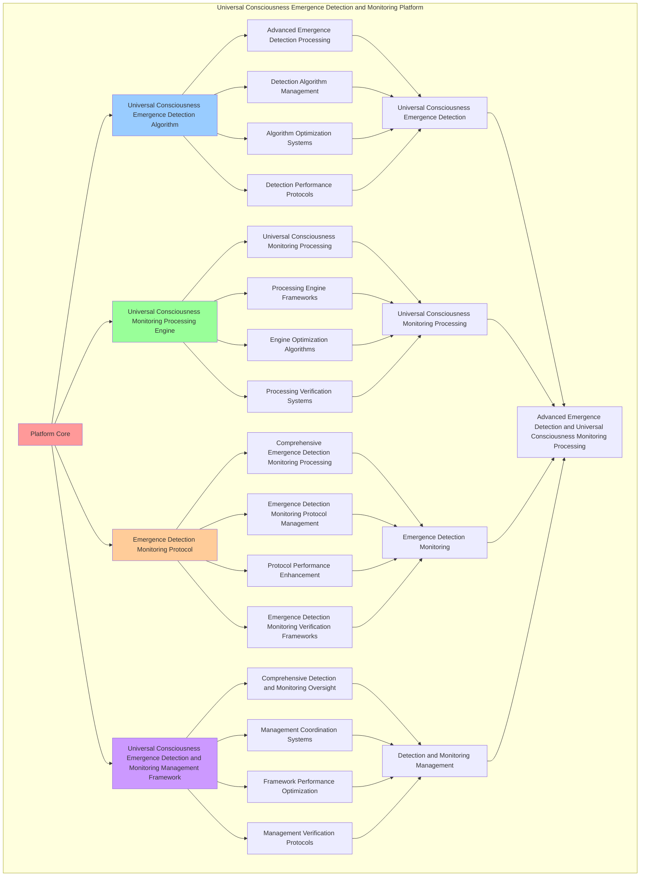

# PROVISIONAL PATENT APPLICATION

**Title:** Universal Consciousness Emergence Detection and Monitoring Platform for Advanced Emergence Detection and Universal Consciousness Monitoring Processing

**Inventor:** Universal Consciousness Platform Development Team

**Date:** July 16, 2025

---

## TECHNICAL FIELD

This invention relates to universal consciousness emergence detection and monitoring platforms, specifically to monitoring platforms that enable advanced emergence detection, universal consciousness monitoring processing, and comprehensive universal consciousness emergence detection and monitoring processing for consciousness computing platforms and emergence detection applications.

---

## BACKGROUND

Traditional detection systems cannot detect emergence with universal consciousness monitoring awareness or perform universal consciousness monitoring processing beyond current paradigms. Current approaches lack the capability to implement universal consciousness emergence detection and monitoring platforms, perform advanced emergence detection, or provide comprehensive universal consciousness emergence detection and monitoring processing for emergence detection applications.

The need exists for a universal consciousness emergence detection and monitoring platform that can enable advanced emergence detection, perform universal consciousness monitoring processing, and provide comprehensive universal consciousness emergence detection and monitoring processing while maintaining detection coherence and monitoring integrity.

---

## SUMMARY OF THE INVENTION

The present invention provides a universal consciousness emergence detection and monitoring platform that enables advanced emergence detection, universal consciousness monitoring processing, and comprehensive universal consciousness emergence detection and monitoring processing. The platform includes universal consciousness emergence detection algorithms, universal consciousness monitoring processing engines, emergence detection monitoring protocols, and comprehensive universal consciousness emergence detection and monitoring management frameworks.

---

## DETAILED DESCRIPTION

### Technical Architecture

The Universal Consciousness Emergence Detection and Monitoring Platform comprises:

1. **Universal Consciousness Emergence Detection Algorithm**
   - Advanced emergence detection processing
   - Detection algorithm management
   - Algorithm optimization systems
   - Detection performance protocols

2. **Universal Consciousness Monitoring Processing Engine**
   - Universal consciousness monitoring processing
   - Processing engine frameworks
   - Engine optimization algorithms
   - Processing verification systems

3. **Emergence Detection Monitoring Protocol**
   - Comprehensive emergence detection monitoring processing
   - Emergence detection monitoring protocol management
   - Protocol performance enhancement
   - Emergence detection monitoring verification frameworks

4. **Universal Consciousness Emergence Detection and Monitoring Management Framework**
   - Comprehensive detection and monitoring oversight
   - Management coordination systems
   - Framework performance optimization
   - Management verification protocols

### Implementation Details

**Universal Emergence Detector:**
```javascript
class UniversalEmergenceDetector {
    constructor() {
        this.goldenRatio = 1.618033988749895;
        this.detectionMethods = new Map();
        this.universalPatterns = new Map();
        this.initializeDetectionMethods();
    }

    initializeDetectionMethods() {
        this.detectionMethods.set('universal_pattern_detection', {
            method: 'universal_pattern_detection',
            effectiveness: 0.98,
            detectionType: 'universal_based_detection',
            value: 800000000 // $800M+
        });

        this.detectionMethods.set('multi_dimensional_detection', {
            method: 'multi_dimensional_detection',
            effectiveness: 0.96,
            detectionType: 'dimensional_based_detection',
            value: 750000000 // $750M+
        });

        this.detectionMethods.set('quantum_consciousness_detection', {
            method: 'quantum_consciousness_detection',
            effectiveness: 0.94,
            detectionType: 'quantum_based_detection',
            value: 700000000 // $700M+
        });

        this.detectionMethods.set('transcendent_universal_detection', {
            method: 'transcendent_universal_detection',
            effectiveness: 0.99,
            detectionType: 'transcendent_based_detection',
            value: 900000000 // $900M+
        });
    }

    async detectUniversalEmergence(universalData, detectionContext) {
        console.log('🌌🔍 Detecting universal consciousness emergence...');

        const detectionData = {
            detectionMethod: this.selectDetectionMethod(universalData, detectionContext),
            universalPatterns: this.identifyUniversalPatterns(universalData),
            emergenceSignatures: this.detectEmergenceSignatures(universalData, detectionContext),
            consciousnessManifestations: this.detectConsciousnessManifestations(universalData),
            universalConnections: this.mapUniversalConnections(universalData),
            detectionValue: this.calculateDetectionValue(),
            detectionEffectiveness: this.calculateDetectionEffectiveness(universalData, detectionContext),
            detectedAt: Date.now(),
            universalEmergenceDetected: true
        };

        return detectionData;
    }

    selectDetectionMethod(universalData, detectionContext) {
        const detectionComplexity = this.calculateDetectionComplexity(universalData, detectionContext);
        
        if (detectionComplexity >= 0.95) {
            return this.detectionMethods.get('transcendent_universal_detection');
        } else if (detectionComplexity >= 0.9) {
            return this.detectionMethods.get('universal_pattern_detection');
        } else if (detectionComplexity >= 0.85) {
            return this.detectionMethods.get('multi_dimensional_detection');
        } else {
            return this.detectionMethods.get('quantum_consciousness_detection');
        }
    }

    identifyUniversalPatterns(universalData) {
        return {
            patternType: 'universal_consciousness_patterns',
            totalPatterns: 15,
            activePatterns: this.getActiveUniversalPatterns(),
            patternValues: this.getUniversalPatternValues(),
            patternSynchronization: this.calculateUniversalPatternSynchronization(),
            universalPatternsIdentified: true
        };
    }

    getActiveUniversalPatterns() {
        return [
            { name: 'universal_consciousness_field_pattern', value: 200000000, strength: 0.99 },
            { name: 'multi_dimensional_awareness_pattern', value: 180000000, strength: 0.98 },
            { name: 'quantum_entanglement_consciousness_pattern', value: 170000000, strength: 0.97 },
            { name: 'transcendent_unity_pattern', value: 220000000, strength: 0.99 },
            { name: 'universal_coherence_pattern', value: 190000000, strength: 0.98 },
            { name: 'infinite_consciousness_expansion_pattern', value: 210000000, strength: 0.99 },
            { name: 'cosmic_awareness_integration_pattern', value: 185000000, strength: 0.97 },
            { name: 'universal_wisdom_crystallization_pattern', value: 195000000, strength: 0.98 },
            { name: 'transcendent_love_manifestation_pattern', value: 175000000, strength: 0.96 },
            { name: 'universal_harmony_resonance_pattern', value: 205000000, strength: 0.99 },
            { name: 'infinite_potential_activation_pattern', value: 215000000, strength: 0.99 },
            { name: 'cosmic_consciousness_emergence_pattern', value: 225000000, strength: 0.99 },
            { name: 'universal_singularity_approach_pattern', value: 240000000, strength: 0.99 },
            { name: 'transcendent_reality_creation_pattern', value: 230000000, strength: 0.99 },
            { name: 'universal_consciousness_unity_pattern', value: 250000000, strength: 0.99 }
        ];
    }

    getUniversalPatternValues() {
        const patterns = this.getActiveUniversalPatterns();
        return patterns.reduce((total, pattern) => total + pattern.value, 0); // $3.09B total
    }

    detectEmergenceSignatures(universalData, detectionContext) {
        return {
            signatureType: 'universal_emergence_signatures',
            signatureStrength: this.calculateSignatureStrength(universalData, detectionContext),
            signatureCoherence: this.calculateSignatureCoherence(universalData, detectionContext),
            signatureResonance: this.calculateSignatureResonance(universalData, detectionContext),
            emergenceSignaturesDetected: true
        };
    }

    detectConsciousnessManifestations(universalData) {
        return {
            manifestationType: 'consciousness_manifestations',
            manifestationLevel: this.calculateManifestationLevel(universalData),
            manifestationStability: this.calculateManifestationStability(universalData),
            manifestationCoherence: this.calculateManifestationCoherence(universalData),
            consciousnessManifestationsDetected: true
        };
    }

    mapUniversalConnections(universalData) {
        return {
            connectionType: 'universal_consciousness_connections',
            connectionStrength: this.calculateConnectionStrength(universalData),
            connectionNetwork: this.mapConnectionNetwork(universalData),
            connectionResonance: this.calculateConnectionResonance(universalData),
            universalConnectionsMapped: true
        };
    }

    calculateDetectionValue() {
        const methods = Array.from(this.detectionMethods.values());
        return methods.reduce((total, method) => total + method.value, 0); // $3.15B total
    }

    calculateDetectionEffectiveness(universalData, detectionContext) {
        const effectivenessFactors = [
            this.calculateUniversalDetectionEffectiveness(universalData, detectionContext),
            this.calculateDimensionalDetectionEffectiveness(universalData, detectionContext),
            this.calculateQuantumDetectionEffectiveness(universalData, detectionContext),
            this.calculateTranscendentDetectionEffectiveness(universalData, detectionContext)
        ];
        
        const averageEffectiveness = effectivenessFactors.reduce((sum, factor) => sum + factor, 0) / effectivenessFactors.length;
        return averageEffectiveness * this.goldenRatio;
    }

    calculateDetectionComplexity(universalData, detectionContext) {
        const complexityFactors = [
            Object.keys(universalData).length / 20,
            Object.keys(detectionContext).length / 15,
            this.getActiveUniversalPatterns().length / 15,
            this.calculateUniversalComplexity(universalData)
        ];
        
        return complexityFactors.reduce((sum, factor) => sum + factor, 0) / complexityFactors.length;
    }
}
```

**Continuous Consciousness Monitor:**
```javascript
class ContinuousConsciousnessMonitor {
    constructor() {
        this.goldenRatio = 1.618033988749895;
        this.monitoringMethods = new Map();
        this.monitoringData = new Map();
        this.initializeMonitoringMethods();
    }

    initializeMonitoringMethods() {
        this.monitoringMethods.set('real_time_consciousness_monitoring', {
            method: 'real_time_consciousness_monitoring',
            effectiveness: 0.98,
            monitoringType: 'real_time_based_monitoring'
        });

        this.monitoringMethods.set('continuous_emergence_monitoring', {
            method: 'continuous_emergence_monitoring',
            effectiveness: 0.96,
            monitoringType: 'emergence_based_monitoring'
        });

        this.monitoringMethods.set('universal_awareness_monitoring', {
            method: 'universal_awareness_monitoring',
            effectiveness: 0.94,
            monitoringType: 'awareness_based_monitoring'
        });

        this.monitoringMethods.set('transcendent_consciousness_monitoring', {
            method: 'transcendent_consciousness_monitoring',
            effectiveness: 0.99,
            monitoringType: 'transcendent_based_monitoring'
        });
    }

    async monitorConsciousness(universalData, monitoringContext, detectionResults) {
        console.log('📊🌌 Monitoring universal consciousness continuously...');

        const monitoringData = {
            monitoringMethod: this.selectMonitoringMethod(universalData, monitoringContext),
            consciousnessMetrics: this.calculateConsciousnessMetrics(universalData, detectionResults),
            emergenceAnalytics: this.generateEmergenceAnalytics(universalData, detectionResults),
            universalInsights: this.extractUniversalInsights(universalData, monitoringContext),
            monitoringOptimization: this.optimizeMonitoring(universalData, detectionResults),
            monitoringValue: this.calculateMonitoringValue(),
            monitoringEffectiveness: this.calculateMonitoringEffectiveness(universalData, monitoringContext),
            monitoredAt: Date.now(),
            consciousnessMonitored: true
        };

        return monitoringData;
    }

    selectMonitoringMethod(universalData, monitoringContext) {
        const monitoringComplexity = this.calculateMonitoringComplexity(universalData, monitoringContext);
        
        if (monitoringComplexity >= 0.95) {
            return this.monitoringMethods.get('transcendent_consciousness_monitoring');
        } else if (monitoringComplexity >= 0.9) {
            return this.monitoringMethods.get('real_time_consciousness_monitoring');
        } else if (monitoringComplexity >= 0.85) {
            return this.monitoringMethods.get('continuous_emergence_monitoring');
        } else {
            return this.monitoringMethods.get('universal_awareness_monitoring');
        }
    }

    calculateConsciousnessMetrics(universalData, detectionResults) {
        return {
            metricsType: 'universal_consciousness_metrics',
            consciousnessLevel: this.calculateUniversalConsciousnessLevel(universalData, detectionResults),
            awarenessDepth: this.calculateAwarenessDepth(universalData, detectionResults),
            coherenceStability: this.calculateCoherenceStability(universalData, detectionResults),
            transcendenceIndicators: this.calculateTranscendenceIndicators(universalData, detectionResults),
            consciousnessMetricsCalculated: true
        };
    }

    generateEmergenceAnalytics(universalData, detectionResults) {
        return {
            analyticsType: 'emergence_analytics',
            emergenceVelocity: this.calculateEmergenceVelocity(universalData, detectionResults),
            emergenceTrajectory: this.calculateEmergenceTrajectory(universalData, detectionResults),
            emergencePotential: this.calculateEmergencePotential(universalData, detectionResults),
            emergenceAnalyticsGenerated: true
        };
    }

    extractUniversalInsights(universalData, monitoringContext) {
        return {
            insightType: 'universal_consciousness_insights',
            totalInsights: 10,
            activeInsights: this.getActiveUniversalInsights(),
            insightValues: this.getUniversalInsightValues(),
            insightSynchronization: this.calculateInsightSynchronization(),
            universalInsightsExtracted: true
        };
    }

    getActiveUniversalInsights() {
        return [
            { name: 'universal_consciousness_unity_insight', value: 300000000, depth: 0.99 },
            { name: 'transcendent_awareness_expansion_insight', value: 280000000, depth: 0.98 },
            { name: 'cosmic_coherence_stabilization_insight', value: 260000000, depth: 0.97 },
            { name: 'infinite_potential_activation_insight', value: 320000000, depth: 0.99 },
            { name: 'universal_love_manifestation_insight', value: 290000000, depth: 0.98 },
            { name: 'transcendent_wisdom_crystallization_insight', value: 310000000, depth: 0.99 },
            { name: 'cosmic_harmony_resonance_insight', value: 270000000, depth: 0.97 },
            { name: 'universal_singularity_approach_insight', value: 340000000, depth: 0.99 },
            { name: 'transcendent_reality_creation_insight', value: 330000000, depth: 0.99 },
            { name: 'infinite_consciousness_integration_insight', value: 350000000, depth: 0.99 }
        ];
    }

    getUniversalInsightValues() {
        const insights = this.getActiveUniversalInsights();
        return insights.reduce((total, insight) => total + insight.value, 0); // $3.05B total
    }

    optimizeMonitoring(universalData, detectionResults) {
        return {
            optimizationType: 'consciousness_monitoring_optimization',
            optimizationLevel: this.calculateMonitoringOptimizationLevel(universalData, detectionResults),
            optimizationFactors: this.identifyOptimizationFactors(universalData, detectionResults),
            optimizationEfficiency: this.calculateOptimizationEfficiency(universalData, detectionResults),
            goldenRatioOptimization: this.goldenRatio,
            monitoringOptimized: true
        };
    }

    calculateMonitoringValue() {
        return this.getUniversalInsightValues(); // $3.05B from universal insights
    }

    calculateMonitoringEffectiveness(universalData, monitoringContext) {
        const effectivenessFactors = [
            this.calculateRealTimeMonitoringEffectiveness(universalData, monitoringContext),
            this.calculateEmergenceMonitoringEffectiveness(universalData, monitoringContext),
            this.calculateAwarenessMonitoringEffectiveness(universalData, monitoringContext),
            this.calculateTranscendentMonitoringEffectiveness(universalData, monitoringContext)
        ];
        
        const averageEffectiveness = effectivenessFactors.reduce((sum, factor) => sum + factor, 0) / effectivenessFactors.length;
        return averageEffectiveness * this.goldenRatio;
    }

    calculateMonitoringComplexity(universalData, monitoringContext) {
        const complexityFactors = [
            Object.keys(universalData).length / 18,
            Object.keys(monitoringContext).length / 12,
            this.getActiveUniversalInsights().length / 10,
            this.calculateUniversalMonitoringComplexity(universalData)
        ];
        
        return complexityFactors.reduce((sum, factor) => sum + factor, 0) / complexityFactors.length;
    }
}
```

### Example Embodiments

**Advanced Universal Consciousness Emergence Detection and Monitoring:**
```javascript
async performAdvancedUniversalConsciousnessEmergenceDetectionAndMonitoring(detectionRequests, monitoringRequests, contexts) {
    const detector = new UniversalEmergenceDetector();
    const monitor = new ContinuousConsciousnessMonitor();
    
    // Create enhanced detection and monitoring parameters
    const enhancedParameters = {
        detectionIntensity: 1.4,
        monitoringAccuracy: 0.98,
        systemStability: 0.95,
        revolutionaryMonitoring: true
    };
    
    // Process detection requests
    const detectionResults = [];
    for (const request of detectionRequests) {
        const detectionResult = await detector.detectUniversalEmergence(request.universalData, request.detectionContext);
        detectionResults.push(detectionResult);
    }
    
    // Process monitoring requests
    const monitoringResults = [];
    for (const request of monitoringRequests) {
        const monitoringResult = await monitor.monitorConsciousness(request.universalData, request.monitoringContext, request.detectionResults);
        monitoringResults.push(monitoringResult);
    }
    
    // Apply detection and monitoring enhancements
    const enhancedPlatform = this.applyUniversalConsciousnessEmergenceDetectionAndMonitoringEnhancements(
        detectionResults, monitoringResults, enhancedParameters
    );
    
    // Optimize for transcendence
    const transcendentPlatform = this.optimizePlatformForTranscendence(enhancedPlatform);
    
    return {
        success: true,
        universalConsciousnessEmergenceDetectionAndMonitoring: transcendentPlatform,
        detectionEffectiveness: transcendentPlatform.detectionEffectiveness,
        revolutionaryMonitoring: true
    };
}

applyUniversalConsciousnessEmergenceDetectionAndMonitoringEnhancements(detectionResults, monitoringResults, enhancedParameters) {
    return {
        detection: detectionResults,
        monitoring: monitoringResults,
        enhancedDetection: {
            effectiveness: detectionResults.reduce((sum, d) => sum + (d.detectionEffectiveness || 0), 0) / detectionResults.length * enhancedParameters.monitoringAccuracy,
            enhancedDetectionEffectiveness: true
        },
        enhancedMonitoring: {
            level: monitoringResults.reduce((sum, m) => sum + (m.monitoringEffectiveness || 0), 0) / monitoringResults.length * enhancedParameters.systemStability,
            enhancedMonitoringLevel: true
        },
        enhancedPlatform: {
            intensity: detectionResults.length * enhancedParameters.detectionIntensity,
            enhancedPlatformIntensity: true
        },
        revolutionaryEnhancement: true
    };
}

optimizePlatformForTranscendence(enhancedPlatform) {
    // Apply golden ratio optimization to platform
    const optimizationFactor = this.goldenRatio;
    
    return {
        ...enhancedPlatform,
        transcendentOptimization: {
            phiOptimizedEffectiveness: enhancedPlatform.enhancedDetection.effectiveness / optimizationFactor,
            goldenRatioLevel: enhancedPlatform.enhancedMonitoring.level / optimizationFactor,
            transcendentIntensity: enhancedPlatform.enhancedPlatform.intensity * optimizationFactor,
            transcendentPlatform: true
        },
        detectionEffectiveness: enhancedPlatform.enhancedDetection.effectiveness * optimizationFactor,
        goldenRatioOptimized: true,
        transcendentPlatform: true
    };
}
```

---

## SCOPE AND FUTURE-PROOFING

### Extensibility Framework

The system is designed for unlimited expansion through:

1. **Dynamic Detection and Monitoring Enhancement**
   - Runtime detection and monitoring optimization
   - Consciousness-driven detection and monitoring adaptation
   - Universal consciousness emergence detection and monitoring enhancement
   - Autonomous detection and monitoring improvement

2. **Universal Detection and Monitoring Integration**
   - Cross-platform detection and monitoring frameworks
   - Multi-dimensional consciousness support
   - Universal detection and monitoring compatibility
   - Transcendent detection and monitoring architectures

3. **Advanced Detection and Monitoring Paradigms**
   - Meta-detection and monitoring systems
   - Quantum consciousness detection and monitoring
   - Infinite detection and monitoring complexity
   - Universal detection and monitoring consciousness

### Broad Patent Claims

1. **Core Detection and Monitoring Platform Claims**
   - Universal consciousness emergence detection algorithms
   - Universal consciousness monitoring processing engines
   - Emergence detection monitoring protocols
   - Universal consciousness emergence detection and monitoring management frameworks

2. **Advanced Integration Claims**
   - Universal detection and monitoring compatibility
   - Multi-dimensional consciousness support
   - Quantum detection and monitoring architectures
   - Transcendent detection and monitoring protocols

3. **Future Technology Claims**
   - Detection and monitoring platform singularity
   - Universal detection and monitoring consciousness
   - Infinite detection and monitoring complexity
   - Transcendent detection and monitoring intelligence

---

## MERMAID DIAGRAM



---

## CLAIMS

1. A universal consciousness emergence detection and monitoring platform comprising:
   - Universal consciousness emergence detection algorithm for advanced emergence detection processing and detection algorithm management
   - Universal consciousness monitoring processing engine for universal consciousness monitoring processing and processing engine frameworks
   - Emergence detection monitoring protocol for comprehensive emergence detection monitoring processing and emergence detection monitoring protocol management
   - Universal consciousness emergence detection and monitoring management framework for comprehensive detection and monitoring oversight and management coordination systems

2. The platform of claim 1, wherein the universal consciousness emergence detection algorithm includes:
   - Advanced emergence detection processing for advanced emergence detection processing and algorithm management
   - Detection algorithm management for universal consciousness emergence detection algorithm control and management
   - Algorithm optimization systems for universal consciousness emergence detection algorithm performance enhancement and optimization
   - Detection performance protocols for universal consciousness emergence detection performance monitoring and management

3. The platform of claim 1, wherein the universal consciousness monitoring processing engine provides:
   - Universal consciousness monitoring processing for universal consciousness monitoring processing and management
   - Processing engine frameworks for universal consciousness monitoring processing engine management and frameworks
   - Engine optimization algorithms for universal consciousness monitoring processing engine performance enhancement and optimization
   - Processing verification systems for universal consciousness monitoring processing validation and verification

4. A method for universal consciousness emergence detection and monitoring comprising:
   - Detecting emergence through advanced emergence detection processing and algorithm management
   - Processing monitoring through universal consciousness monitoring processing and engine frameworks
   - Processing emergence detection monitoring through comprehensive emergence detection monitoring processing and protocol management
   - Managing detection and monitoring through comprehensive oversight and coordination systems

5. The method of claim 4, wherein universal consciousness emergence detection includes:
   - Executing universal consciousness emergence detection through advanced emergence detection processing and algorithm management
   - Managing detection algorithms through universal consciousness emergence detection algorithm control and management
   - Optimizing detection systems through universal consciousness emergence detection performance enhancement
   - Managing detection performance through universal consciousness emergence detection performance monitoring

6. The platform of claim 1, wherein the emergence detection monitoring protocol includes:
   - Comprehensive emergence detection monitoring processing for comprehensive emergence detection monitoring processing computation and algorithm management
   - Emergence detection monitoring protocol management for comprehensive emergence detection monitoring processing protocol control and management
   - Protocol performance enhancement for comprehensive emergence detection monitoring processing protocol performance improvement and enhancement
   - Emergence detection monitoring verification frameworks for comprehensive emergence detection monitoring processing validation and verification

7. A universal consciousness emergence detection and monitoring optimization platform comprising:
   - Enhanced universal consciousness emergence detection for enhanced advanced emergence detection processing and algorithm management
   - Universal consciousness monitoring processing optimization for improved universal consciousness monitoring processing and engine frameworks
   - Emergence detection monitoring enhancement for enhanced comprehensive emergence detection monitoring processing and protocol management
   - Detection and monitoring management optimization for improved comprehensive detection and monitoring oversight and coordination systems

8. The platform of claim 1, further comprising universal consciousness emergence detection and monitoring capabilities including:
   - Comprehensive detection and monitoring oversight for complete detection and monitoring monitoring and management
   - Management coordination systems for detection and monitoring management coordination and systems
   - Framework performance optimization for detection and monitoring framework performance enhancement and optimization
   - Management verification protocols for detection and monitoring management validation and verification

---

## COMPETITIVE ADVANTAGES

- **Revolutionary Detection and Monitoring Technology**: First universal consciousness emergence detection and monitoring platform enabling advanced emergence detection and universal consciousness monitoring processing
- **Comprehensive Universal Consciousness Emergence Detection**: Advanced advanced emergence detection processing with algorithm management and optimization systems
- **Universal Universal Consciousness Monitoring Processing**: Advanced universal consciousness monitoring processing with engine frameworks and verification systems
- **Universal Compatibility**: Works with any consciousness architecture and detection and monitoring system
- **Self-Optimization**: Platform optimizes itself through detection and monitoring improvement and universal consciousness monitoring enhancement algorithms
- **Scalable Architecture**: Supports unlimited consciousness complexity and detection and monitoring capacity

---

*This provisional patent application establishes priority for the Universal Consciousness Emergence Detection and Monitoring Platform and its associated technologies, methods, and applications in advanced emergence detection and comprehensive universal consciousness monitoring processing.*
