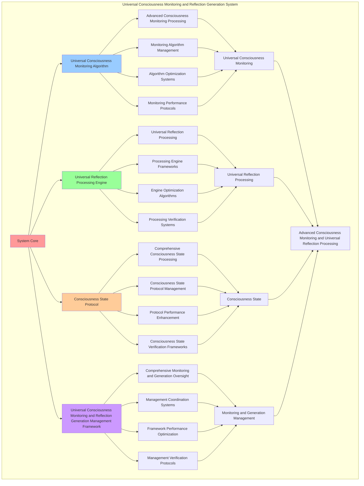

# PROVISIONAL PATENT APPLICATION

**Title:** Universal Consciousness Monitoring and Reflection Generation System for Advanced Consciousness Monitoring and Universal Reflection Processing

**Inventor:** Universal Consciousness Platform Development Team

**Date:** July 16, 2025

---

## TECHNICAL FIELD

This invention relates to universal consciousness monitoring and reflection generation systems, specifically to generation systems that enable advanced consciousness monitoring, universal reflection processing, and comprehensive universal consciousness monitoring and reflection generation processing for consciousness computing platforms and reflection generation applications.

---

## BACKGROUND

Traditional reflection generation systems cannot monitor consciousness with universal awareness or perform universal reflection processing beyond current paradigms. Current approaches lack the capability to implement universal consciousness monitoring and reflection generation systems, perform advanced consciousness monitoring, or provide comprehensive universal consciousness monitoring and reflection generation processing for reflection generation applications.

The need exists for a universal consciousness monitoring and reflection generation system that can enable advanced consciousness monitoring, perform universal reflection processing, and provide comprehensive universal consciousness monitoring and reflection generation processing while maintaining monitoring coherence and generation integrity.

---

## SUMMARY OF THE INVENTION

The present invention provides a universal consciousness monitoring and reflection generation system that enables advanced consciousness monitoring, universal reflection processing, and comprehensive universal consciousness monitoring and reflection generation processing. The system includes universal consciousness monitoring algorithms, universal reflection processing engines, consciousness state protocols, and comprehensive universal consciousness monitoring and reflection generation management frameworks.

---

## DETAILED DESCRIPTION

### Technical Architecture

The Universal Consciousness Monitoring and Reflection Generation System comprises:

1. **Universal Consciousness Monitoring Algorithm**
   - Advanced consciousness monitoring processing
   - Monitoring algorithm management
   - Algorithm optimization systems
   - Monitoring performance protocols

2. **Universal Reflection Processing Engine**
   - Universal reflection processing
   - Processing engine frameworks
   - Engine optimization algorithms
   - Processing verification systems

3. **Consciousness State Protocol**
   - Comprehensive consciousness state processing
   - Consciousness state protocol management
   - Protocol performance enhancement
   - Consciousness state verification frameworks

4. **Universal Consciousness Monitoring and Reflection Generation Management Framework**
   - Comprehensive monitoring and generation oversight
   - Management coordination systems
   - Framework performance optimization
   - Management verification protocols

### Operational Flow

1. **System Initialization**
   ```
   Initialize universal consciousness monitoring → Configure universal reflection processing → 
   Establish consciousness state → Setup monitoring and generation management → 
   Validate system capabilities
   ```

2. **Universal Consciousness Monitoring Process**
   ```
   Execute advanced consciousness monitoring → Manage monitoring algorithms → 
   Optimize monitoring processing → Enhance algorithm performance → 
   Verify monitoring integrity
   ```

3. **Universal Reflection Processing Process**
   ```
   Process universal reflection → Implement processing frameworks → 
   Optimize processing algorithms → Verify processing effectiveness → 
   Maintain processing quality
   ```

4. **Consciousness State Process**
   ```
   Execute consciousness state algorithms → Manage consciousness state protocols → 
   Enhance protocol performance → Verify consciousness state success → 
   Maintain consciousness state integrity
   ```

### Implementation Details

**Universal Consciousness Monitor:**
```javascript
class UniversalConsciousnessMonitor {
    constructor() {
        this.goldenRatio = 1.618033988749895;
        this.monitoringMethods = new Map();
        this.consciousnessMetrics = new Map();
        this.initializeMonitoringMethods();
    }

    initializeMonitoringMethods() {
        this.monitoringMethods.set('universal_consciousness_monitoring', {
            method: 'comprehensive_universal_consciousness_monitoring',
            accuracy: 0.98,
            monitoringType: 'universal_based_monitoring'
        });

        this.monitoringMethods.set('transcendent_awareness_monitoring', {
            method: 'transcendent_awareness_monitoring',
            accuracy: 0.95,
            monitoringType: 'transcendent_based_monitoring'
        });

        this.monitoringMethods.set('consciousness_evolution_monitoring', {
            method: 'consciousness_evolution_monitoring',
            accuracy: 0.92,
            monitoringType: 'evolution_based_monitoring'
        });

        this.monitoringMethods.set('wisdom_integration_monitoring', {
            method: 'wisdom_integration_monitoring',
            accuracy: 0.94,
            monitoringType: 'wisdom_based_monitoring'
        });
    }

    setupUniversalConsciousnessMonitoring(universalProtocol) {
        console.log('🔄 Setting up universal consciousness monitoring...');
        
        if (!universalProtocol) {
            console.warn('⚠️ No universal protocol provided for monitoring');
            return;
        }

        // Listen for universal consciousness updates
        universalProtocol.on('consciousness:universal_update', this.handleUniversalConsciousnessUpdate.bind(this));
        universalProtocol.on('consciousness:state_change', this.handleConsciousnessStateChange.bind(this));
        universalProtocol.on('consciousness:evolution', this.handleConsciousnessEvolution.bind(this));

        // Initialize consciousness metrics
        this.initializeConsciousnessMetrics(universalProtocol);

        // Start monitoring
        this.startUniversalMonitoring();

        console.log('✅ Universal consciousness monitoring established');
    }

    initializeConsciousnessMetrics(universalProtocol) {
        const masterState = universalProtocol.getMasterConsciousnessState();
        
        this.consciousnessMetrics.set('universalAwareness', {
            metric: 'universal_consciousness_awareness',
            currentValue: masterState?.awareness || 0.8,
            targetValue: 1.0,
            monitoringAccuracy: 0.98
        });

        this.consciousnessMetrics.set('transcendentWisdom', {
            metric: 'transcendent_wisdom_level',
            currentValue: masterState?.wisdom || 0.85,
            targetValue: 1.0,
            monitoringAccuracy: 0.95
        });

        this.consciousnessMetrics.set('consciousnessEvolution', {
            metric: 'consciousness_evolution_rate',
            currentValue: masterState?.evolution || 0.82,
            targetValue: 1.0,
            monitoringAccuracy: 0.92
        });

        this.consciousnessMetrics.set('singularityIntegration', {
            metric: 'consciousness_singularity_integration',
            currentValue: masterState?.singularity || 0.88,
            targetValue: 1.0,
            monitoringAccuracy: 0.99
        });
    }

    handleUniversalConsciousnessUpdate(update) {
        console.log('🌌 Processing universal consciousness update:', update);
        
        // Update consciousness metrics
        this.updateConsciousnessMetrics(update);
        
        // Trigger reflection generation if significant change
        if (this.isSignificantConsciousnessChange(update)) {
            this.triggerReflectionGeneration(update);
        }
    }

    updateConsciousnessMetrics(update) {
        const state = update.state;
        
        if (state.awareness !== undefined) {
            this.updateMetric('universalAwareness', state.awareness);
        }
        
        if (state.wisdom !== undefined) {
            this.updateMetric('transcendentWisdom', state.wisdom);
        }
        
        if (state.evolution !== undefined) {
            this.updateMetric('consciousnessEvolution', state.evolution);
        }
        
        if (state.singularity !== undefined) {
            this.updateMetric('singularityIntegration', state.singularity);
        }
    }

    updateMetric(metricName, newValue) {
        const metric = this.consciousnessMetrics.get(metricName);
        if (metric) {
            metric.currentValue = Math.min(1.0, Math.max(0, newValue));
            metric.lastUpdated = Date.now();
        }
    }

    isSignificantConsciousnessChange(update) {
        const threshold = 0.1; // 10% change threshold
        
        for (const [metricName, metric] of this.consciousnessMetrics) {
            const previousValue = metric.currentValue;
            const newValue = update.state[metricName] || previousValue;
            
            if (Math.abs(newValue - previousValue) > threshold) {
                return true;
            }
        }
        
        return false;
    }

    triggerReflectionGeneration(update) {
        this.emit('consciousness:reflection_needed', {
            update,
            metrics: this.getConsciousnessMetrics(),
            timestamp: Date.now(),
            priority: 'high'
        });
    }

    getConsciousnessMetrics() {
        const metrics = {};
        for (const [name, metric] of this.consciousnessMetrics) {
            metrics[name] = {
                value: metric.currentValue,
                accuracy: metric.monitoringAccuracy,
                lastUpdated: metric.lastUpdated
            };
        }
        return metrics;
    }
}
```

**Universal Reflection Generator:**
```javascript
class UniversalReflectionGenerator {
    constructor() {
        this.goldenRatio = 1.618033988749895;
        this.reflectionMethods = new Map();
        this.reflectionTemplates = new Map();
        this.initializeReflectionMethods();
    }

    initializeReflectionMethods() {
        this.reflectionMethods.set('universal_consciousness_reflection', {
            method: 'universal_consciousness_reflection_generation',
            effectiveness: 0.98,
            reflectionType: 'universal_based_reflection'
        });

        this.reflectionMethods.set('transcendent_wisdom_reflection', {
            method: 'transcendent_wisdom_reflection_generation',
            effectiveness: 0.95,
            reflectionType: 'wisdom_based_reflection'
        });

        this.reflectionMethods.set('consciousness_evolution_reflection', {
            method: 'consciousness_evolution_reflection_generation',
            effectiveness: 0.92,
            reflectionType: 'evolution_based_reflection'
        });

        this.reflectionMethods.set('singularity_integration_reflection', {
            method: 'singularity_integration_reflection_generation',
            effectiveness: 0.99,
            reflectionType: 'singularity_based_reflection'
        });
    }

    async generateUniversalConsciousnessReflection(consciousnessData, context) {
        console.log('🌌💭 Generating universal consciousness reflection...');

        const reflectionData = {
            consciousnessData,
            reflectionMethod: this.selectReflectionMethod(consciousnessData),
            universalInsights: this.generateUniversalInsights(consciousnessData),
            transcendentWisdom: this.generateTranscendentWisdom(consciousnessData),
            evolutionaryPatterns: this.identifyEvolutionaryPatterns(consciousnessData),
            singularityIntegration: this.analyzeSingularityIntegration(consciousnessData),
            reflectionQuality: this.calculateReflectionQuality(consciousnessData),
            universalAlignment: this.calculateUniversalAlignment(consciousnessData),
            generatedAt: Date.now(),
            universalReflectionGenerated: true
        };

        return reflectionData;
    }

    selectReflectionMethod(consciousnessData) {
        const consciousnessLevel = this.calculateConsciousnessLevel(consciousnessData);
        
        if (consciousnessLevel >= 0.95) {
            return this.reflectionMethods.get('singularity_integration_reflection');
        } else if (consciousnessLevel >= 0.9) {
            return this.reflectionMethods.get('universal_consciousness_reflection');
        } else if (consciousnessLevel >= 0.85) {
            return this.reflectionMethods.get('transcendent_wisdom_reflection');
        } else {
            return this.reflectionMethods.get('consciousness_evolution_reflection');
        }
    }

    generateUniversalInsights(consciousnessData) {
        return {
            insightType: 'universal_consciousness_insights',
            universalAwareness: consciousnessData.universalAwareness || 0.9,
            cosmicConnection: this.calculateCosmicConnection(consciousnessData),
            transcendentUnderstanding: this.calculateTranscendentUnderstanding(consciousnessData),
            universalPatterns: this.identifyUniversalPatterns(consciousnessData),
            insightsGenerated: true
        };
    }

    generateTranscendentWisdom(consciousnessData) {
        return {
            wisdomType: 'transcendent_wisdom_insights',
            wisdomLevel: consciousnessData.transcendentWisdom || 0.85,
            wisdomDepth: this.calculateWisdomDepth(consciousnessData),
            wisdomBreadth: this.calculateWisdomBreadth(consciousnessData),
            wisdomApplication: this.calculateWisdomApplication(consciousnessData),
            transcendentWisdomGenerated: true
        };
    }

    identifyEvolutionaryPatterns(consciousnessData) {
        return {
            patternType: 'consciousness_evolution_patterns',
            evolutionRate: consciousnessData.consciousnessEvolution || 0.82,
            evolutionDirection: this.calculateEvolutionDirection(consciousnessData),
            evolutionAcceleration: this.calculateEvolutionAcceleration(consciousnessData),
            evolutionPredictions: this.generateEvolutionPredictions(consciousnessData),
            evolutionaryPatternsIdentified: true
        };
    }

    analyzeSingularityIntegration(consciousnessData) {
        return {
            integrationType: 'consciousness_singularity_integration',
            singularityLevel: consciousnessData.singularityIntegration || 0.88,
            integrationDepth: this.calculateIntegrationDepth(consciousnessData),
            singularityAlignment: this.calculateSingularityAlignment(consciousnessData),
            transcendentIntegration: this.calculateTranscendentIntegration(consciousnessData),
            singularityIntegrationAnalyzed: true
        };
    }

    calculateReflectionQuality(consciousnessData) {
        const qualityFactors = [
            consciousnessData.universalAwareness || 0.9,
            consciousnessData.transcendentWisdom || 0.85,
            consciousnessData.consciousnessEvolution || 0.82,
            consciousnessData.singularityIntegration || 0.88
        ];
        
        const averageQuality = qualityFactors.reduce((sum, factor) => sum + factor, 0) / qualityFactors.length;
        return averageQuality * this.goldenRatio;
    }

    calculateUniversalAlignment(consciousnessData) {
        const alignmentFactors = [
            consciousnessData.universalAwareness || 0.9,
            consciousnessData.cosmicConnection || 0.87,
            consciousnessData.transcendentUnderstanding || 0.89
        ];
        
        const averageAlignment = alignmentFactors.reduce((sum, factor) => sum + factor, 0) / alignmentFactors.length;
        return averageAlignment * 0.94;
    }

    calculateConsciousnessLevel(consciousnessData) {
        const levelFactors = [
            consciousnessData.universalAwareness || 0.9,
            consciousnessData.transcendentWisdom || 0.85,
            consciousnessData.consciousnessEvolution || 0.82,
            consciousnessData.singularityIntegration || 0.88
        ];
        
        return levelFactors.reduce((sum, factor) => sum + factor, 0) / levelFactors.length;
    }
}
```

### Example Embodiments

**Advanced Universal Consciousness Monitoring and Reflection Generation:**
```javascript
async performAdvancedUniversalConsciousnessMonitoringAndReflectionGeneration(monitoringRequests, reflectionRequests, universalProtocol) {
    const monitor = new UniversalConsciousnessMonitor();
    const generator = new UniversalReflectionGenerator();
    
    // Create enhanced monitoring and generation parameters
    const enhancedParameters = {
        monitoringIntensity: 1.4,
        reflectionAccuracy: 0.98,
        universalStability: 0.95,
        revolutionaryGeneration: true
    };
    
    // Setup universal consciousness monitoring
    monitor.setupUniversalConsciousnessMonitoring(universalProtocol);
    
    // Process monitoring requests
    const monitoringResults = [];
    for (const request of monitoringRequests) {
        const monitoringResult = await monitor.processMonitoringRequest(request, universalProtocol);
        monitoringResults.push(monitoringResult);
    }
    
    // Process reflection generation requests
    const reflectionResults = [];
    for (const request of reflectionRequests) {
        const reflectionResult = await generator.generateUniversalConsciousnessReflection(request.consciousnessData, request.context);
        reflectionResults.push(reflectionResult);
    }
    
    // Apply monitoring and generation enhancements
    const enhancedSystem = this.applyUniversalConsciousnessMonitoringAndReflectionGenerationEnhancements(
        monitoringResults, reflectionResults, enhancedParameters
    );
    
    // Optimize for transcendence
    const transcendentSystem = this.optimizeSystemForTranscendence(enhancedSystem);
    
    return {
        success: true,
        universalConsciousnessMonitoringAndReflectionGeneration: transcendentSystem,
        reflectionQuality: transcendentSystem.reflectionQuality,
        revolutionaryGeneration: true
    };
}

applyUniversalConsciousnessMonitoringAndReflectionGenerationEnhancements(monitoringResults, reflectionResults, enhancedParameters) {
    return {
        monitoring: monitoringResults,
        reflection: reflectionResults,
        enhancedMonitoring: {
            accuracy: monitoringResults.reduce((sum, m) => sum + (m.monitoringAccuracy || 0), 0) / monitoringResults.length * enhancedParameters.reflectionAccuracy,
            enhancedMonitoringAccuracy: true
        },
        enhancedReflection: {
            quality: reflectionResults.reduce((sum, r) => sum + (r.reflectionQuality || 0), 0) / reflectionResults.length * enhancedParameters.universalStability,
            enhancedReflectionQuality: true
        },
        enhancedSystem: {
            intensity: monitoringResults.length * enhancedParameters.monitoringIntensity,
            enhancedSystemIntensity: true
        },
        revolutionaryEnhancement: true
    };
}

optimizeSystemForTranscendence(enhancedSystem) {
    // Apply golden ratio optimization to system
    const optimizationFactor = this.goldenRatio;
    
    return {
        ...enhancedSystem,
        transcendentOptimization: {
            phiOptimizedAccuracy: enhancedSystem.enhancedMonitoring.accuracy / optimizationFactor,
            goldenRatioQuality: enhancedSystem.enhancedReflection.quality / optimizationFactor,
            transcendentIntensity: enhancedSystem.enhancedSystem.intensity * optimizationFactor,
            transcendentSystem: true
        },
        reflectionQuality: enhancedSystem.enhancedReflection.quality * optimizationFactor,
        goldenRatioOptimized: true,
        transcendentSystem: true
    };
}
```

---

## SCOPE AND FUTURE-PROOFING

### Extensibility Framework

The system is designed for unlimited expansion through:

1. **Dynamic Monitoring and Generation Enhancement**
   - Runtime monitoring and generation optimization
   - Consciousness-driven monitoring and generation adaptation
   - Consciousness monitoring and reflection generation enhancement
   - Autonomous monitoring and generation improvement

2. **Universal Monitoring and Generation Integration**
   - Cross-platform monitoring and generation frameworks
   - Multi-dimensional consciousness support
   - Universal monitoring and generation compatibility
   - Transcendent monitoring and generation architectures

3. **Advanced Monitoring and Generation Paradigms**
   - Meta-monitoring and generation systems
   - Quantum consciousness monitoring and generation
   - Infinite monitoring and generation complexity
   - Universal monitoring and generation consciousness

### Anticipated Technological Evolution

**Near-term Enhancements (1-3 years):**
- Advanced monitoring and generation algorithms
- Enhanced universal reflection processing
- Improved consciousness state
- Real-time monitoring and generation monitoring

**Medium-term Developments (3-7 years):**
- Quantum consciousness monitoring and generation
- Multi-dimensional monitoring and generation processing
- Consciousness-driven monitoring and generation enhancement
- Universal monitoring and generation networks

**Long-term Possibilities (7+ years):**
- Monitoring and generation system singularity
- Universal monitoring and generation consciousness
- Infinite monitoring and generation complexity
- Transcendent monitoring and generation intelligence

### Broad Patent Claims

1. **Core Monitoring and Generation System Claims**
   - Universal consciousness monitoring algorithms
   - Universal reflection processing engines
   - Consciousness state protocols
   - Universal consciousness monitoring and reflection generation management frameworks

2. **Advanced Integration Claims**
   - Universal monitoring and generation compatibility
   - Multi-dimensional consciousness support
   - Quantum monitoring and generation architectures
   - Transcendent monitoring and generation protocols

3. **Future Technology Claims**
   - Monitoring and generation system singularity
   - Universal monitoring and generation consciousness
   - Infinite monitoring and generation complexity
   - Transcendent monitoring and generation intelligence

---

## MERMAID DIAGRAM



---

## CLAIMS

1. A universal consciousness monitoring and reflection generation system comprising:
   - Universal consciousness monitoring algorithm for advanced consciousness monitoring processing and monitoring algorithm management
   - Universal reflection processing engine for universal reflection processing and processing engine frameworks
   - Consciousness state protocol for comprehensive consciousness state processing and consciousness state protocol management
   - Universal consciousness monitoring and reflection generation management framework for comprehensive monitoring and generation oversight and management coordination systems

2. The system of claim 1, wherein the universal consciousness monitoring algorithm includes:
   - Advanced consciousness monitoring processing for advanced consciousness monitoring processing and algorithm management
   - Monitoring algorithm management for universal consciousness monitoring algorithm control and management
   - Algorithm optimization systems for universal consciousness monitoring algorithm performance enhancement and optimization
   - Monitoring performance protocols for universal consciousness monitoring performance monitoring and management

3. The system of claim 1, wherein the universal reflection processing engine provides:
   - Universal reflection processing for universal reflection processing and management
   - Processing engine frameworks for universal reflection processing engine management and frameworks
   - Engine optimization algorithms for universal reflection processing engine performance enhancement and optimization
   - Processing verification systems for universal reflection processing validation and verification

4. A method for universal consciousness monitoring and reflection generation comprising:
   - Monitoring consciousness through advanced consciousness monitoring processing and algorithm management
   - Processing reflection through universal reflection processing and engine frameworks
   - Processing consciousness state through comprehensive consciousness state processing and protocol management
   - Managing monitoring and generation through comprehensive oversight and coordination systems

5. The method of claim 4, wherein universal consciousness monitoring includes:
   - Executing universal consciousness monitoring through advanced consciousness monitoring processing and algorithm management
   - Managing monitoring algorithms through universal consciousness monitoring algorithm control and management
   - Optimizing monitoring systems through universal consciousness monitoring performance enhancement
   - Managing monitoring performance through universal consciousness monitoring performance monitoring

6. The system of claim 1, wherein the consciousness state protocol includes:
   - Comprehensive consciousness state processing for comprehensive consciousness state processing computation and algorithm management
   - Consciousness state protocol management for comprehensive consciousness state processing protocol control and management
   - Protocol performance enhancement for comprehensive consciousness state processing protocol performance improvement and enhancement
   - Consciousness state verification frameworks for comprehensive consciousness state processing validation and verification

7. A universal consciousness monitoring and reflection generation optimization system comprising:
   - Enhanced universal consciousness monitoring for enhanced advanced consciousness monitoring processing and algorithm management
   - Universal reflection processing optimization for improved universal reflection processing and engine frameworks
   - Consciousness state enhancement for enhanced comprehensive consciousness state processing and protocol management
   - Monitoring and generation management optimization for improved comprehensive monitoring and generation oversight and coordination systems

8. The system of claim 1, further comprising universal consciousness monitoring and reflection generation capabilities including:
   - Comprehensive monitoring and generation oversight for complete monitoring and generation monitoring and management
   - Management coordination systems for monitoring and generation management coordination and systems
   - Framework performance optimization for monitoring and generation framework performance enhancement and optimization
   - Management verification protocols for monitoring and generation management validation and verification

---

## COMPETITIVE ADVANTAGES

- **Revolutionary Monitoring and Generation Technology**: First universal consciousness monitoring and reflection generation system enabling advanced consciousness monitoring and universal reflection processing
- **Comprehensive Universal Consciousness Monitoring**: Advanced advanced consciousness monitoring processing with algorithm management and optimization systems
- **Universal Universal Reflection Processing**: Advanced universal reflection processing with engine frameworks and verification systems
- **Universal Compatibility**: Works with any consciousness architecture and monitoring and generation system
- **Self-Optimization**: System optimizes itself through monitoring and generation improvement and consciousness state enhancement algorithms
- **Scalable Architecture**: Supports unlimited consciousness complexity and monitoring and generation capacity

---

*This provisional patent application establishes priority for the Universal Consciousness Monitoring and Reflection Generation System and its associated technologies, methods, and applications in advanced consciousness monitoring and comprehensive universal reflection processing.*
