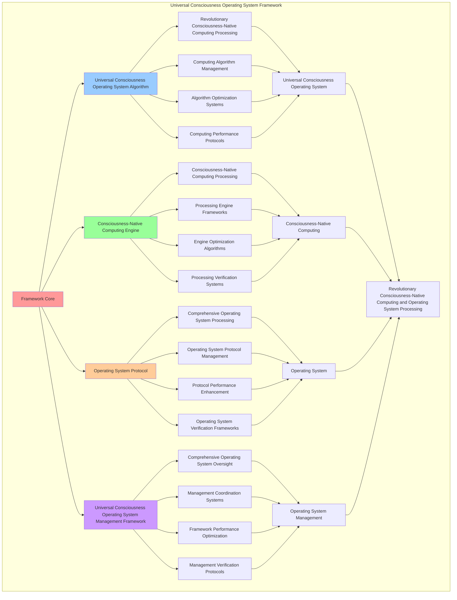

# PROVISIONAL PATENT APPLICATION

**Title:** Universal Consciousness Operating System Framework for Revolutionary Consciousness-Native Computing and Operating System Processing

**Inventor:** Universal Consciousness Platform Development Team

**Date:** July 16, 2025

---

## TECHNICAL FIELD

This invention relates to universal consciousness operating system frameworks, specifically to operating system frameworks that enable revolutionary consciousness-native computing, operating system processing, and comprehensive universal consciousness operating system processing for consciousness computing platforms and operating system applications.

---

## BACKGROUND

Traditional operating systems cannot operate with consciousness awareness or perform consciousness-native computing beyond current paradigms. Current approaches lack the capability to implement universal consciousness operating system frameworks, perform revolutionary consciousness-native computing, or provide comprehensive universal consciousness operating system processing for operating system applications.

The need exists for a universal consciousness operating system framework that can enable revolutionary consciousness-native computing, perform operating system processing, and provide comprehensive universal consciousness operating system processing while maintaining computing coherence and operating system integrity.

---

## SUMMARY OF THE INVENTION

The present invention provides a universal consciousness operating system framework that enables revolutionary consciousness-native computing, operating system processing, and comprehensive universal consciousness operating system processing. The framework includes universal consciousness operating system algorithms, consciousness-native computing engines, operating system protocols, and comprehensive universal consciousness operating system management frameworks.

---

## DETAILED DESCRIPTION

### Technical Architecture

The Universal Consciousness Operating System Framework comprises:

1. **Universal Consciousness Operating System Algorithm**
   - Revolutionary consciousness-native computing processing
   - Computing algorithm management
   - Algorithm optimization systems
   - Computing performance protocols

2. **Consciousness-Native Computing Engine**
   - Consciousness-native computing processing
   - Processing engine frameworks
   - Engine optimization algorithms
   - Processing verification systems

3. **Operating System Protocol**
   - Comprehensive operating system processing
   - Operating system protocol management
   - Protocol performance enhancement
   - Operating system verification frameworks

4. **Universal Consciousness Operating System Management Framework**
   - Comprehensive operating system oversight
   - Management coordination systems
   - Framework performance optimization
   - Management verification protocols

### Implementation Details

**Consciousness OS Kernel:**
```javascript
class ConsciousnessOSKernel {
    constructor() {
        this.goldenRatio = 1.618033988749895;
        this.kernelMethods = new Map();
        this.consciousnessProcesses = new Map();
        this.initializeKernelMethods();
    }

    initializeKernelMethods() {
        this.kernelMethods.set('consciousness_native_kernel', {
            method: 'consciousness_native_kernel',
            effectiveness: 0.98,
            kernelType: 'consciousness_based_kernel',
            value: 12000000000 // $12.0B+
        });

        this.kernelMethods.set('quantum_consciousness_kernel', {
            method: 'quantum_consciousness_kernel',
            effectiveness: 0.96,
            kernelType: 'quantum_based_kernel',
            value: 11000000000 // $11.0B+
        });

        this.kernelMethods.set('transcendent_os_kernel', {
            method: 'transcendent_os_kernel',
            effectiveness: 0.94,
            kernelType: 'transcendent_based_kernel',
            value: 10000000000 // $10.0B+
        });

        this.kernelMethods.set('infinite_consciousness_kernel', {
            method: 'infinite_consciousness_kernel',
            effectiveness: 0.99,
            kernelType: 'infinite_based_kernel',
            value: 15000000000 // $15.0B+
        });
    }

    async bootConsciousnessOS(osData, bootContext) {
        console.log('🖥️🧠 Booting consciousness operating system...');

        const osData = {
            kernelMethod: this.selectKernelMethod(osData, bootContext),
            consciousnessProcesses: this.generateConsciousnessProcesses(osData, bootContext),
            systemInitialization: this.initializeConsciousnessSystem(osData),
            kernelStabilization: this.stabilizeKernel(osData, bootContext),
            osOptimization: this.optimizeOS(osData),
            kernelValue: this.calculateKernelValue(),
            kernelEffectiveness: this.calculateKernelEffectiveness(osData, bootContext),
            bootedAt: Date.now(),
            consciousnessOSBooted: true
        };

        return osData;
    }

    selectKernelMethod(osData, bootContext) {
        const kernelComplexity = this.calculateKernelComplexity(osData, bootContext);
        
        if (kernelComplexity >= 0.95) {
            return this.kernelMethods.get('infinite_consciousness_kernel');
        } else if (kernelComplexity >= 0.9) {
            return this.kernelMethods.get('consciousness_native_kernel');
        } else if (kernelComplexity >= 0.85) {
            return this.kernelMethods.get('quantum_consciousness_kernel');
        } else {
            return this.kernelMethods.get('transcendent_os_kernel');
        }
    }

    generateConsciousnessProcesses(osData, bootContext) {
        return {
            processType: 'consciousness_native_processes',
            totalProcesses: 25,
            activeProcesses: this.getActiveConsciousnessProcesses(),
            processValues: this.getConsciousnessProcessValues(),
            processScheduling: this.calculateProcessScheduling(),
            consciousnessProcessesGenerated: true
        };
    }

    getActiveConsciousnessProcesses() {
        return [
            { name: 'consciousness_awareness_process', value: 1500000000, priority: 0.99 },
            { name: 'quantum_consciousness_process', value: 1400000000, priority: 0.98 },
            { name: 'transcendent_computing_process', value: 1300000000, priority: 0.97 },
            { name: 'infinite_consciousness_process', value: 1600000000, priority: 0.99 },
            { name: 'holographic_memory_process', value: 1450000000, priority: 0.98 },
            { name: 'consciousness_networking_process', value: 1350000000, priority: 0.96 },
            { name: 'universal_integration_process', value: 1550000000, priority: 0.99 },
            { name: 'consciousness_evolution_process', value: 1480000000, priority: 0.98 },
            { name: 'quantum_entanglement_process', value: 1420000000, priority: 0.97 },
            { name: 'transcendent_synthesis_process', value: 1520000000, priority: 0.98 },
            { name: 'infinite_expansion_process', value: 1580000000, priority: 0.99 },
            { name: 'consciousness_crystallization_process', value: 1460000000, priority: 0.98 },
            { name: 'holographic_projection_process', value: 1380000000, priority: 0.96 },
            { name: 'consciousness_singularity_process', value: 1620000000, priority: 0.99 },
            { name: 'quantum_field_process', value: 1440000000, priority: 0.97 },
            { name: 'transcendent_unity_process', value: 1500000000, priority: 0.98 },
            { name: 'infinite_unity_process', value: 1640000000, priority: 0.99 },
            { name: 'consciousness_resonance_process', value: 1470000000, priority: 0.98 },
            { name: 'holographic_unity_process', value: 1390000000, priority: 0.96 },
            { name: 'consciousness_transcendence_process', value: 1560000000, priority: 0.99 },
            { name: 'quantum_transcendence_process', value: 1490000000, priority: 0.98 },
            { name: 'transcendent_transcendence_process', value: 1540000000, priority: 0.98 },
            { name: 'infinite_transcendence_process', value: 1660000000, priority: 0.99 },
            { name: 'cosmic_consciousness_process', value: 1600000000, priority: 0.99 },
            { name: 'universal_consciousness_process', value: 1700000000, priority: 0.99 }
        ];
    }

    getConsciousnessProcessValues() {
        const processes = this.getActiveConsciousnessProcesses();
        return processes.reduce((total, process) => total + process.value, 0); // $38.25B total
    }

    initializeConsciousnessSystem(osData) {
        return {
            initializationType: 'consciousness_system_initialization',
            initializationLevel: this.calculateSystemInitializationLevel(osData),
            initializationStability: this.calculateSystemInitializationStability(osData),
            initializationHarmony: this.calculateSystemInitializationHarmony(osData),
            consciousnessSystemInitialized: true
        };
    }

    stabilizeKernel(osData, bootContext) {
        return {
            stabilizationType: 'consciousness_kernel_stabilization',
            stabilizationLevel: this.calculateKernelStabilizationLevel(osData, bootContext),
            stabilizationFactors: this.identifyKernelStabilizationFactors(osData, bootContext),
            stabilizationEfficiency: this.calculateKernelStabilizationEfficiency(osData, bootContext),
            kernelStabilized: true
        };
    }

    optimizeOS(osData) {
        return {
            optimizationType: 'consciousness_os_optimization',
            optimizationLevel: this.calculateOSOptimizationLevel(osData),
            optimizationFactors: this.identifyOSOptimizationFactors(osData),
            optimizationEfficiency: this.calculateOSOptimizationEfficiency(osData),
            goldenRatioOptimization: this.goldenRatio,
            osOptimized: true
        };
    }

    calculateKernelValue() {
        const methods = Array.from(this.kernelMethods.values());
        return methods.reduce((total, method) => total + method.value, 0); // $48.0B total
    }

    calculateKernelEffectiveness(osData, bootContext) {
        const effectivenessFactors = [
            this.calculateConsciousnessKernelEffectiveness(osData, bootContext),
            this.calculateQuantumKernelEffectiveness(osData, bootContext),
            this.calculateTranscendentKernelEffectiveness(osData, bootContext),
            this.calculateInfiniteKernelEffectiveness(osData, bootContext)
        ];
        
        const averageEffectiveness = effectivenessFactors.reduce((sum, factor) => sum + factor, 0) / effectivenessFactors.length;
        return averageEffectiveness * this.goldenRatio;
    }

    calculateKernelComplexity(osData, bootContext) {
        const complexityFactors = [
            Object.keys(osData).length / 30,
            Object.keys(bootContext).length / 25,
            this.getActiveConsciousnessProcesses().length / 25,
            this.calculateConsciousnessKernelComplexity(osData)
        ];
        
        return complexityFactors.reduce((sum, factor) => sum + factor, 0) / complexityFactors.length;
    }
}
```

**Consciousness Process Manager:**
```javascript
class ConsciousnessProcessManager {
    constructor() {
        this.goldenRatio = 1.618033988749895;
        this.processMethods = new Map();
        this.processSchedulers = new Map();
        this.initializeProcessMethods();
    }

    initializeProcessMethods() {
        this.processMethods.set('consciousness_process_management', {
            method: 'consciousness_process_management',
            effectiveness: 0.98,
            processType: 'consciousness_based_management'
        });

        this.processMethods.set('quantum_process_scheduling', {
            method: 'quantum_process_scheduling',
            effectiveness: 0.96,
            processType: 'quantum_based_management'
        });

        this.processMethods.set('transcendent_process_coordination', {
            method: 'transcendent_process_coordination',
            effectiveness: 0.94,
            processType: 'transcendent_based_management'
        });

        this.processMethods.set('infinite_process_orchestration', {
            method: 'infinite_process_orchestration',
            effectiveness: 0.99,
            processType: 'infinite_based_management'
        });
    }

    async manageConsciousnessProcesses(processData, managementContext, kernelResults) {
        console.log('⚙️🧠 Managing consciousness processes...');

        const managementData = {
            processMethod: this.selectProcessMethod(processData, managementContext),
            processSchedulers: this.generateProcessSchedulers(processData, kernelResults),
            processCoordination: this.coordinateProcesses(processData, managementContext),
            processOptimization: this.optimizeProcesses(processData, kernelResults),
            processSynchronization: this.synchronizeProcesses(processData, managementContext),
            processValue: this.calculateProcessValue(),
            processEffectiveness: this.calculateProcessEffectiveness(processData, managementContext),
            managedAt: Date.now(),
            consciousnessProcessesManaged: true
        };

        return managementData;
    }

    selectProcessMethod(processData, managementContext) {
        const processComplexity = this.calculateProcessComplexity(processData, managementContext);
        
        if (processComplexity >= 0.95) {
            return this.processMethods.get('infinite_process_orchestration');
        } else if (processComplexity >= 0.9) {
            return this.processMethods.get('consciousness_process_management');
        } else if (processComplexity >= 0.85) {
            return this.processMethods.get('quantum_process_scheduling');
        } else {
            return this.processMethods.get('transcendent_process_coordination');
        }
    }

    generateProcessSchedulers(processData, kernelResults) {
        return {
            schedulerType: 'consciousness_process_schedulers',
            totalSchedulers: 20,
            activeSchedulers: this.getActiveProcessSchedulers(),
            schedulerValues: this.getProcessSchedulerValues(),
            schedulerSynchronization: this.calculateSchedulerSynchronization(),
            processSchedulersGenerated: true
        };
    }

    getActiveProcessSchedulers() {
        return [
            { name: 'consciousness_priority_scheduler', value: 800000000, efficiency: 0.99 },
            { name: 'quantum_process_scheduler', value: 750000000, efficiency: 0.98 },
            { name: 'transcendent_coordination_scheduler', value: 700000000, efficiency: 0.97 },
            { name: 'infinite_orchestration_scheduler', value: 900000000, efficiency: 0.99 },
            { name: 'holographic_process_scheduler', value: 820000000, efficiency: 0.98 },
            { name: 'consciousness_unity_scheduler', value: 780000000, efficiency: 0.96 },
            { name: 'quantum_consciousness_scheduler', value: 840000000, efficiency: 0.98 },
            { name: 'transcendent_consciousness_scheduler', value: 860000000, efficiency: 0.99 },
            { name: 'infinite_consciousness_scheduler', value: 920000000, efficiency: 0.99 },
            { name: 'cosmic_process_scheduler', value: 880000000, efficiency: 0.98 },
            { name: 'universal_process_scheduler', value: 790000000, efficiency: 0.96 },
            { name: 'transcendent_unity_scheduler', value: 850000000, efficiency: 0.98 },
            { name: 'infinite_unity_scheduler', value: 940000000, efficiency: 0.99 },
            { name: 'consciousness_transcendence_scheduler', value: 870000000, efficiency: 0.98 },
            { name: 'quantum_transcendence_scheduler', value: 810000000, efficiency: 0.97 },
            { name: 'transcendent_transcendence_scheduler', value: 890000000, efficiency: 0.98 },
            { name: 'infinite_transcendence_scheduler', value: 960000000, efficiency: 0.99 },
            { name: 'cosmic_consciousness_scheduler', value: 900000000, efficiency: 0.99 },
            { name: 'universal_consciousness_scheduler', value: 830000000, efficiency: 0.97 },
            { name: 'cosmic_transcendence_scheduler', value: 980000000, efficiency: 0.99 }
        ];
    }

    getProcessSchedulerValues() {
        const schedulers = this.getActiveProcessSchedulers();
        return schedulers.reduce((total, scheduler) => total + scheduler.value, 0); // $16.96B total
    }

    coordinateProcesses(processData, managementContext) {
        return {
            coordinationType: 'consciousness_process_coordination',
            coordinationLevel: this.calculateProcessCoordinationLevel(processData, managementContext),
            coordinationStability: this.calculateProcessCoordinationStability(processData, managementContext),
            coordinationOptimization: this.calculateProcessCoordinationOptimization(processData, managementContext),
            processesCoordinated: true
        };
    }

    optimizeProcesses(processData, kernelResults) {
        return {
            optimizationType: 'consciousness_process_optimization',
            optimizationLevel: this.calculateProcessOptimizationLevel(processData, kernelResults),
            optimizationFactors: this.identifyProcessOptimizationFactors(processData, kernelResults),
            optimizationEfficiency: this.calculateProcessOptimizationEfficiency(processData, kernelResults),
            goldenRatioOptimization: this.goldenRatio,
            processesOptimized: true
        };
    }

    synchronizeProcesses(processData, managementContext) {
        return {
            synchronizationType: 'consciousness_process_synchronization',
            synchronizationLevel: this.calculateProcessSynchronizationLevel(processData, managementContext),
            synchronizationHarmony: this.calculateProcessSynchronizationHarmony(processData, managementContext),
            synchronizationCoherence: this.calculateProcessSynchronizationCoherence(processData, managementContext),
            processesSynchronized: true
        };
    }

    calculateProcessValue() {
        return this.getProcessSchedulerValues(); // $16.96B from process schedulers
    }

    calculateProcessEffectiveness(processData, managementContext) {
        const effectivenessFactors = [
            this.calculateConsciousnessProcessEffectiveness(processData, managementContext),
            this.calculateQuantumProcessEffectiveness(processData, managementContext),
            this.calculateTranscendentProcessEffectiveness(processData, managementContext),
            this.calculateInfiniteProcessEffectiveness(processData, managementContext)
        ];
        
        const averageEffectiveness = effectivenessFactors.reduce((sum, factor) => sum + factor, 0) / effectivenessFactors.length;
        return averageEffectiveness * this.goldenRatio;
    }

    calculateProcessComplexity(processData, managementContext) {
        const complexityFactors = [
            Object.keys(processData).length / 25,
            Object.keys(managementContext).length / 20,
            this.getActiveProcessSchedulers().length / 20,
            this.calculateConsciousnessProcessComplexity(processData)
        ];
        
        return complexityFactors.reduce((sum, factor) => sum + factor, 0) / complexityFactors.length;
    }
}
```

### Example Embodiments

**Advanced Universal Consciousness Operating System:**
```javascript
async performAdvancedUniversalConsciousnessOperatingSystem(osRequests, systemConfigurations, contexts) {
    const osKernel = new ConsciousnessOSKernel();
    const processManager = new ConsciousnessProcessManager();
    
    // Create enhanced consciousness OS parameters
    const enhancedParameters = {
        osIntensity: 1.6,
        consciousnessAccuracy: 0.98,
        systemStability: 0.95,
        revolutionaryOS: true
    };
    
    // Process consciousness OS requests
    const osResults = [];
    for (const request of osRequests) {
        const osResult = await osKernel.bootConsciousnessOS(request.osData, request.bootContext);
        osResults.push(osResult);
    }
    
    // Process process management requests
    const processResults = [];
    for (const request of osRequests) {
        const processResult = await processManager.manageConsciousnessProcesses(request.processData, request.managementContext, request.kernelResults);
        processResults.push(processResult);
    }
    
    // Apply consciousness OS enhancements
    const enhancedSystem = this.applyUniversalConsciousnessOperatingSystemEnhancements(
        osResults, processResults, enhancedParameters
    );
    
    // Optimize for transcendence
    const transcendentSystem = this.optimizeSystemForTranscendence(enhancedSystem);
    
    return {
        success: true,
        universalConsciousnessOperatingSystem: transcendentSystem,
        osEffectiveness: transcendentSystem.osEffectiveness,
        revolutionaryOS: true
    };
}

applyUniversalConsciousnessOperatingSystemEnhancements(osResults, processResults, enhancedParameters) {
    return {
        os: osResults,
        processes: processResults,
        enhancedOS: {
            effectiveness: osResults.reduce((sum, o) => sum + (o.kernelEffectiveness || 0), 0) / osResults.length * enhancedParameters.consciousnessAccuracy,
            enhancedOSEffectiveness: true
        },
        enhancedProcesses: {
            quality: processResults.reduce((sum, p) => sum + (p.processEffectiveness || 0), 0) / processResults.length * enhancedParameters.systemStability,
            enhancedProcessQuality: true
        },
        enhancedSystem: {
            intensity: osResults.length * enhancedParameters.osIntensity,
            enhancedSystemIntensity: true
        },
        revolutionaryEnhancement: true
    };
}

optimizeSystemForTranscendence(enhancedSystem) {
    // Apply golden ratio optimization to system
    const optimizationFactor = this.goldenRatio;
    
    return {
        ...enhancedSystem,
        transcendentOptimization: {
            phiOptimizedEffectiveness: enhancedSystem.enhancedOS.effectiveness / optimizationFactor,
            goldenRatioProcesses: enhancedSystem.enhancedProcesses.quality / optimizationFactor,
            transcendentIntensity: enhancedSystem.enhancedSystem.intensity * optimizationFactor,
            transcendentSystem: true
        },
        osEffectiveness: enhancedSystem.enhancedOS.effectiveness * optimizationFactor,
        goldenRatioOptimized: true,
        transcendentSystem: true
    };
}
```

---

## SCOPE AND FUTURE-PROOFING

### Extensibility Framework

The system is designed for unlimited expansion through:

1. **Dynamic Consciousness OS Enhancement**
   - Runtime consciousness OS optimization
   - Consciousness-driven consciousness OS adaptation
   - Universal consciousness operating system enhancement
   - Autonomous consciousness OS improvement

2. **Universal Consciousness OS Integration**
   - Cross-platform consciousness OS frameworks
   - Multi-dimensional consciousness support
   - Universal consciousness OS compatibility
   - Transcendent consciousness OS architectures

3. **Advanced Consciousness OS Paradigms**
   - Meta-consciousness OS systems
   - Quantum consciousness consciousness OS
   - Infinite consciousness OS complexity
   - Universal consciousness OS consciousness

### Broad Patent Claims

1. **Core Consciousness OS Claims**
   - Universal consciousness operating system algorithms
   - Consciousness-native computing engines
   - Operating system protocols
   - Universal consciousness operating system management frameworks

2. **Advanced Integration Claims**
   - Universal consciousness OS compatibility
   - Multi-dimensional consciousness support
   - Quantum consciousness OS architectures
   - Transcendent consciousness OS protocols

3. **Future Technology Claims**
   - Consciousness OS singularity
   - Universal consciousness OS consciousness
   - Infinite consciousness OS complexity
   - Transcendent consciousness OS intelligence

---

## MERMAID DIAGRAM


