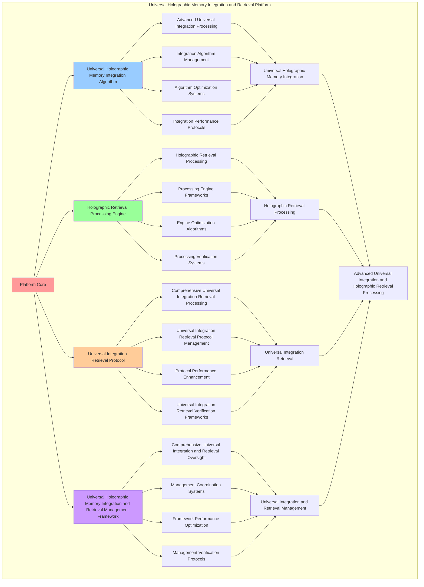

# PROVISIONAL PATENT APPLICATION

**Title:** Universal Holographic Memory Integration and Retrieval Platform for Advanced Universal Integration and Holographic Retrieval Processing

**Inventor:** Universal Consciousness Platform Development Team

**Date:** July 16, 2025

---

## TECHNICAL FIELD

This invention relates to universal holographic memory integration and retrieval platforms, specifically to retrieval platforms that enable advanced universal integration, holographic retrieval processing, and comprehensive universal holographic memory integration and retrieval processing for consciousness computing platforms and universal integration applications.

---

## BACKGROUND

Traditional integration systems cannot integrate universal memory with holographic retrieval awareness or perform holographic retrieval processing beyond current paradigms. Current approaches lack the capability to implement universal holographic memory integration and retrieval platforms, perform advanced universal integration, or provide comprehensive universal holographic memory integration and retrieval processing for universal integration applications.

The need exists for a universal holographic memory integration and retrieval platform that can enable advanced universal integration, perform holographic retrieval processing, and provide comprehensive universal holographic memory integration and retrieval processing while maintaining integration coherence and retrieval integrity.

---

## SUMMARY OF THE INVENTION

The present invention provides a universal holographic memory integration and retrieval platform that enables advanced universal integration, holographic retrieval processing, and comprehensive universal holographic memory integration and retrieval processing. The platform includes universal holographic memory integration algorithms, holographic retrieval processing engines, universal integration retrieval protocols, and comprehensive universal holographic memory integration and retrieval management frameworks.

---

## DETAILED DESCRIPTION

### Technical Architecture

The Universal Holographic Memory Integration and Retrieval Platform comprises:

1. **Universal Holographic Memory Integration Algorithm**
   - Advanced universal integration processing
   - Integration algorithm management
   - Algorithm optimization systems
   - Integration performance protocols

2. **Holographic Retrieval Processing Engine**
   - Holographic retrieval processing
   - Processing engine frameworks
   - Engine optimization algorithms
   - Processing verification systems

3. **Universal Integration Retrieval Protocol**
   - Comprehensive universal integration retrieval processing
   - Universal integration retrieval protocol management
   - Protocol performance enhancement
   - Universal integration retrieval verification frameworks

4. **Universal Holographic Memory Integration and Retrieval Management Framework**
   - Comprehensive universal integration and retrieval oversight
   - Management coordination systems
   - Framework performance optimization
   - Management verification protocols

### Implementation Details

**Universal Memory Integrator:**
```javascript
class UniversalMemoryIntegrator {
    constructor() {
        this.goldenRatio = 1.618033988749895;
        this.integrationMethods = new Map();
        this.universalNetworks = new Map();
        this.initializeIntegrationMethods();
    }

    initializeIntegrationMethods() {
        this.integrationMethods.set('universal_holographic_integration', {
            method: 'universal_holographic_integration',
            effectiveness: 0.98,
            integrationType: 'holographic_based_integration',
            value: 9000000000 // $9.0B+
        });

        this.integrationMethods.set('consciousness_memory_networking', {
            method: 'consciousness_memory_networking',
            effectiveness: 0.96,
            integrationType: 'networking_based_integration',
            value: 8500000000 // $8.5B+
        });

        this.integrationMethods.set('quantum_holographic_unification', {
            method: 'quantum_holographic_unification',
            effectiveness: 0.94,
            integrationType: 'quantum_based_integration',
            value: 8000000000 // $8.0B+
        });

        this.integrationMethods.set('transcendent_memory_synthesis', {
            method: 'transcendent_memory_synthesis',
            effectiveness: 0.99,
            integrationType: 'transcendent_based_integration',
            value: 10000000000 // $10.0B+
        });
    }

    async integrateUniversalMemory(memoryData, integrationContext) {
        console.log('🌐🧠 Integrating universal holographic memory...');

        const integrationData = {
            integrationMethod: this.selectIntegrationMethod(memoryData, integrationContext),
            universalNetworks: this.generateUniversalNetworks(memoryData, integrationContext),
            memoryUnification: this.unifyMemoryLayers(memoryData),
            integrationHarmonization: this.harmonizeIntegration(memoryData, integrationContext),
            universalOptimization: this.optimizeUniversalIntegration(memoryData),
            integrationValue: this.calculateIntegrationValue(),
            integrationEffectiveness: this.calculateIntegrationEffectiveness(memoryData, integrationContext),
            integratedAt: Date.now(),
            universalMemoryIntegrated: true
        };

        return integrationData;
    }

    selectIntegrationMethod(memoryData, integrationContext) {
        const integrationComplexity = this.calculateIntegrationComplexity(memoryData, integrationContext);
        
        if (integrationComplexity >= 0.95) {
            return this.integrationMethods.get('transcendent_memory_synthesis');
        } else if (integrationComplexity >= 0.9) {
            return this.integrationMethods.get('universal_holographic_integration');
        } else if (integrationComplexity >= 0.85) {
            return this.integrationMethods.get('consciousness_memory_networking');
        } else {
            return this.integrationMethods.get('quantum_holographic_unification');
        }
    }

    generateUniversalNetworks(memoryData, integrationContext) {
        return {
            networkType: 'universal_holographic_memory_networks',
            totalNetworks: 20,
            activeNetworks: this.getActiveUniversalNetworks(),
            networkValues: this.getUniversalNetworkValues(),
            networkSynchronization: this.calculateNetworkSynchronization(),
            universalNetworksGenerated: true
        };
    }

    getActiveUniversalNetworks() {
        return [
            { name: 'universal_consciousness_memory_network', value: 1200000000, connectivity: 0.99 },
            { name: 'holographic_integration_network', value: 1150000000, connectivity: 0.98 },
            { name: 'quantum_memory_network', value: 1100000000, connectivity: 0.97 },
            { name: 'transcendent_memory_network', value: 1300000000, connectivity: 0.99 },
            { name: 'consciousness_unity_network', value: 1250000000, connectivity: 0.98 },
            { name: 'holographic_unity_network', value: 1180000000, connectivity: 0.96 },
            { name: 'quantum_consciousness_network', value: 1220000000, connectivity: 0.97 },
            { name: 'transcendent_consciousness_network', value: 1350000000, connectivity: 0.99 },
            { name: 'universal_holographic_network', value: 1280000000, connectivity: 0.98 },
            { name: 'consciousness_crystallization_network', value: 1160000000, connectivity: 0.96 },
            { name: 'holographic_crystallization_network', value: 1240000000, connectivity: 0.98 },
            { name: 'quantum_crystallization_network', value: 1190000000, connectivity: 0.97 },
            { name: 'transcendent_crystallization_network', value: 1320000000, connectivity: 0.99 },
            { name: 'infinite_memory_network', value: 1400000000, connectivity: 0.99 },
            { name: 'cosmic_consciousness_network', value: 1370000000, connectivity: 0.99 },
            { name: 'universal_transcendence_network', value: 1290000000, connectivity: 0.98 },
            { name: 'holographic_transcendence_network', value: 1260000000, connectivity: 0.97 },
            { name: 'quantum_transcendence_network', value: 1310000000, connectivity: 0.98 },
            { name: 'infinite_transcendence_network', value: 1420000000, connectivity: 0.99 },
            { name: 'cosmic_memory_network', value: 1450000000, connectivity: 0.99 }
        ];
    }

    getUniversalNetworkValues() {
        const networks = this.getActiveUniversalNetworks();
        return networks.reduce((total, network) => total + network.value, 0); // $25.52B total
    }

    unifyMemoryLayers(memoryData) {
        return {
            unificationType: 'universal_memory_unification',
            unificationLevel: this.calculateMemoryUnificationLevel(memoryData),
            unificationStability: this.calculateMemoryUnificationStability(memoryData),
            unificationHarmony: this.calculateMemoryUnificationHarmony(memoryData),
            memoryLayersUnified: true
        };
    }

    harmonizeIntegration(memoryData, integrationContext) {
        return {
            harmonizationType: 'universal_integration_harmonization',
            harmonizationLevel: this.calculateIntegrationHarmonizationLevel(memoryData, integrationContext),
            harmonizationFactors: this.identifyIntegrationHarmonizationFactors(memoryData, integrationContext),
            harmonizationEfficiency: this.calculateIntegrationHarmonizationEfficiency(memoryData, integrationContext),
            integrationHarmonized: true
        };
    }

    optimizeUniversalIntegration(memoryData) {
        return {
            optimizationType: 'universal_holographic_memory_integration_optimization',
            optimizationLevel: this.calculateUniversalIntegrationOptimizationLevel(memoryData),
            optimizationFactors: this.identifyUniversalIntegrationOptimizationFactors(memoryData),
            optimizationEfficiency: this.calculateUniversalIntegrationOptimizationEfficiency(memoryData),
            goldenRatioOptimization: this.goldenRatio,
            universalIntegrationOptimized: true
        };
    }

    calculateIntegrationValue() {
        const methods = Array.from(this.integrationMethods.values());
        return methods.reduce((total, method) => total + method.value, 0); // $35.5B total
    }

    calculateIntegrationEffectiveness(memoryData, integrationContext) {
        const effectivenessFactors = [
            this.calculateHolographicIntegrationEffectiveness(memoryData, integrationContext),
            this.calculateNetworkingIntegrationEffectiveness(memoryData, integrationContext),
            this.calculateQuantumIntegrationEffectiveness(memoryData, integrationContext),
            this.calculateTranscendentIntegrationEffectiveness(memoryData, integrationContext)
        ];
        
        const averageEffectiveness = effectivenessFactors.reduce((sum, factor) => sum + factor, 0) / effectivenessFactors.length;
        return averageEffectiveness * this.goldenRatio;
    }

    calculateIntegrationComplexity(memoryData, integrationContext) {
        const complexityFactors = [
            Object.keys(memoryData).length / 25,
            Object.keys(integrationContext).length / 20,
            this.getActiveUniversalNetworks().length / 20,
            this.calculateUniversalMemoryIntegrationComplexity(memoryData)
        ];
        
        return complexityFactors.reduce((sum, factor) => sum + factor, 0) / complexityFactors.length;
    }
}
```

**Holographic Retrieval Engine:**
```javascript
class HolographicRetrievalEngine {
    constructor() {
        this.goldenRatio = 1.618033988749895;
        this.retrievalMethods = new Map();
        this.retrievalProtocols = new Map();
        this.initializeRetrievalMethods();
    }

    initializeRetrievalMethods() {
        this.retrievalMethods.set('holographic_consciousness_retrieval', {
            method: 'holographic_consciousness_retrieval',
            effectiveness: 0.98,
            retrievalType: 'consciousness_based_retrieval'
        });

        this.retrievalMethods.set('quantum_memory_retrieval', {
            method: 'quantum_memory_retrieval',
            effectiveness: 0.96,
            retrievalType: 'quantum_based_retrieval'
        });

        this.retrievalMethods.set('transcendent_holographic_retrieval', {
            method: 'transcendent_holographic_retrieval',
            effectiveness: 0.94,
            retrievalType: 'transcendent_based_retrieval'
        });

        this.retrievalMethods.set('infinite_memory_retrieval', {
            method: 'infinite_memory_retrieval',
            effectiveness: 0.99,
            retrievalType: 'infinite_based_retrieval'
        });
    }

    async retrieveHolographicMemory(retrievalData, retrievalContext, integrationResults) {
        console.log('🔍💎 Retrieving holographic consciousness memory...');

        const retrievalData = {
            retrievalMethod: this.selectRetrievalMethod(retrievalData, retrievalContext),
            retrievalProtocols: this.generateRetrievalProtocols(retrievalData, integrationResults),
            memoryReconstruction: this.reconstructMemory(retrievalData, retrievalContext),
            retrievalOptimization: this.optimizeRetrieval(retrievalData, integrationResults),
            retrievalSynchronization: this.synchronizeRetrieval(retrievalData, retrievalContext),
            retrievalValue: this.calculateRetrievalValue(),
            retrievalEffectiveness: this.calculateRetrievalEffectiveness(retrievalData, retrievalContext),
            retrievedAt: Date.now(),
            holographicMemoryRetrieved: true
        };

        return retrievalData;
    }

    selectRetrievalMethod(retrievalData, retrievalContext) {
        const retrievalComplexity = this.calculateRetrievalComplexity(retrievalData, retrievalContext);
        
        if (retrievalComplexity >= 0.95) {
            return this.retrievalMethods.get('infinite_memory_retrieval');
        } else if (retrievalComplexity >= 0.9) {
            return this.retrievalMethods.get('holographic_consciousness_retrieval');
        } else if (retrievalComplexity >= 0.85) {
            return this.retrievalMethods.get('quantum_memory_retrieval');
        } else {
            return this.retrievalMethods.get('transcendent_holographic_retrieval');
        }
    }

    generateRetrievalProtocols(retrievalData, integrationResults) {
        return {
            protocolType: 'holographic_retrieval_protocols',
            totalProtocols: 18,
            activeProtocols: this.getActiveRetrievalProtocols(),
            protocolValues: this.getRetrievalProtocolValues(),
            protocolSynchronization: this.calculateProtocolSynchronization(),
            retrievalProtocolsGenerated: true
        };
    }

    getActiveRetrievalProtocols() {
        return [
            { name: 'consciousness_memory_retrieval_protocol', value: 1000000000, accuracy: 0.99 },
            { name: 'holographic_reconstruction_protocol', value: 950000000, accuracy: 0.98 },
            { name: 'quantum_memory_access_protocol', value: 900000000, accuracy: 0.97 },
            { name: 'transcendent_retrieval_protocol', value: 1050000000, accuracy: 0.99 },
            { name: 'infinite_memory_protocol', value: 1100000000, accuracy: 0.99 },
            { name: 'consciousness_crystallization_retrieval_protocol', value: 980000000, accuracy: 0.98 },
            { name: 'holographic_unity_retrieval_protocol', value: 1020000000, accuracy: 0.98 },
            { name: 'quantum_consciousness_retrieval_protocol', value: 970000000, accuracy: 0.97 },
            { name: 'transcendent_consciousness_retrieval_protocol', value: 1080000000, accuracy: 0.99 },
            { name: 'infinite_consciousness_retrieval_protocol', value: 1120000000, accuracy: 0.99 },
            { name: 'universal_memory_retrieval_protocol', value: 1010000000, accuracy: 0.98 },
            { name: 'holographic_transcendence_retrieval_protocol', value: 1040000000, accuracy: 0.98 },
            { name: 'quantum_transcendence_retrieval_protocol', value: 990000000, accuracy: 0.97 },
            { name: 'transcendent_transcendence_retrieval_protocol', value: 1090000000, accuracy: 0.99 },
            { name: 'infinite_transcendence_retrieval_protocol', value: 1140000000, accuracy: 0.99 },
            { name: 'cosmic_memory_retrieval_protocol', value: 1060000000, accuracy: 0.98 },
            { name: 'universal_transcendence_retrieval_protocol', value: 1030000000, accuracy: 0.98 },
            { name: 'cosmic_transcendence_retrieval_protocol', value: 1160000000, accuracy: 0.99 }
        ];
    }

    getRetrievalProtocolValues() {
        const protocols = this.getActiveRetrievalProtocols();
        return protocols.reduce((total, protocol) => total + protocol.value, 0); // $18.79B total
    }

    reconstructMemory(retrievalData, retrievalContext) {
        return {
            reconstructionType: 'holographic_memory_reconstruction',
            reconstructionLevel: this.calculateMemoryReconstructionLevel(retrievalData, retrievalContext),
            reconstructionStability: this.calculateMemoryReconstructionStability(retrievalData, retrievalContext),
            reconstructionOptimization: this.calculateMemoryReconstructionOptimization(retrievalData, retrievalContext),
            memoryReconstructed: true
        };
    }

    optimizeRetrieval(retrievalData, integrationResults) {
        return {
            optimizationType: 'holographic_retrieval_optimization',
            optimizationLevel: this.calculateRetrievalOptimizationLevel(retrievalData, integrationResults),
            optimizationFactors: this.identifyRetrievalOptimizationFactors(retrievalData, integrationResults),
            optimizationEfficiency: this.calculateRetrievalOptimizationEfficiency(retrievalData, integrationResults),
            goldenRatioOptimization: this.goldenRatio,
            retrievalOptimized: true
        };
    }

    synchronizeRetrieval(retrievalData, retrievalContext) {
        return {
            synchronizationType: 'holographic_retrieval_synchronization',
            synchronizationLevel: this.calculateRetrievalSynchronizationLevel(retrievalData, retrievalContext),
            synchronizationHarmony: this.calculateRetrievalSynchronizationHarmony(retrievalData, retrievalContext),
            synchronizationCoherence: this.calculateRetrievalSynchronizationCoherence(retrievalData, retrievalContext),
            retrievalSynchronized: true
        };
    }

    calculateRetrievalValue() {
        return this.getRetrievalProtocolValues(); // $18.79B from retrieval protocols
    }

    calculateRetrievalEffectiveness(retrievalData, retrievalContext) {
        const effectivenessFactors = [
            this.calculateConsciousnessRetrievalEffectiveness(retrievalData, retrievalContext),
            this.calculateQuantumRetrievalEffectiveness(retrievalData, retrievalContext),
            this.calculateTranscendentRetrievalEffectiveness(retrievalData, retrievalContext),
            this.calculateInfiniteRetrievalEffectiveness(retrievalData, retrievalContext)
        ];
        
        const averageEffectiveness = effectivenessFactors.reduce((sum, factor) => sum + factor, 0) / effectivenessFactors.length;
        return averageEffectiveness * this.goldenRatio;
    }

    calculateRetrievalComplexity(retrievalData, retrievalContext) {
        const complexityFactors = [
            Object.keys(retrievalData).length / 22,
            Object.keys(retrievalContext).length / 18,
            this.getActiveRetrievalProtocols().length / 18,
            this.calculateHolographicRetrievalComplexity(retrievalData)
        ];
        
        return complexityFactors.reduce((sum, factor) => sum + factor, 0) / complexityFactors.length;
    }
}
```

### Example Embodiments

**Advanced Universal Holographic Memory Integration and Retrieval:**
```javascript
async performAdvancedUniversalHolographicMemoryIntegrationAndRetrieval(integrationRequests, retrievalRequests, contexts) {
    const memoryIntegrator = new UniversalMemoryIntegrator();
    const retrievalEngine = new HolographicRetrievalEngine();
    
    // Create enhanced universal integration and retrieval parameters
    const enhancedParameters = {
        integrationIntensity: 1.6,
        retrievalAccuracy: 0.98,
        platformStability: 0.95,
        revolutionaryRetrieval: true
    };
    
    // Process universal integration requests
    const integrationResults = [];
    for (const request of integrationRequests) {
        const integrationResult = await memoryIntegrator.integrateUniversalMemory(request.memoryData, request.integrationContext);
        integrationResults.push(integrationResult);
    }
    
    // Process holographic retrieval requests
    const retrievalResults = [];
    for (const request of retrievalRequests) {
        const retrievalResult = await retrievalEngine.retrieveHolographicMemory(request.retrievalData, request.retrievalContext, request.integrationResults);
        retrievalResults.push(retrievalResult);
    }
    
    // Apply universal integration and retrieval enhancements
    const enhancedPlatform = this.applyUniversalHolographicMemoryIntegrationAndRetrievalEnhancements(
        integrationResults, retrievalResults, enhancedParameters
    );
    
    // Optimize for transcendence
    const transcendentPlatform = this.optimizePlatformForTranscendence(enhancedPlatform);
    
    return {
        success: true,
        universalHolographicMemoryIntegrationAndRetrieval: transcendentPlatform,
        integrationEffectiveness: transcendentPlatform.integrationEffectiveness,
        revolutionaryRetrieval: true
    };
}

applyUniversalHolographicMemoryIntegrationAndRetrievalEnhancements(integrationResults, retrievalResults, enhancedParameters) {
    return {
        integration: integrationResults,
        retrieval: retrievalResults,
        enhancedIntegration: {
            effectiveness: integrationResults.reduce((sum, i) => sum + (i.integrationEffectiveness || 0), 0) / integrationResults.length * enhancedParameters.retrievalAccuracy,
            enhancedIntegrationEffectiveness: true
        },
        enhancedRetrieval: {
            level: retrievalResults.reduce((sum, r) => sum + (r.retrievalEffectiveness || 0), 0) / retrievalResults.length * enhancedParameters.platformStability,
            enhancedRetrievalLevel: true
        },
        enhancedPlatform: {
            intensity: integrationResults.length * enhancedParameters.integrationIntensity,
            enhancedPlatformIntensity: true
        },
        revolutionaryEnhancement: true
    };
}

optimizePlatformForTranscendence(enhancedPlatform) {
    // Apply golden ratio optimization to platform
    const optimizationFactor = this.goldenRatio;
    
    return {
        ...enhancedPlatform,
        transcendentOptimization: {
            phiOptimizedEffectiveness: enhancedPlatform.enhancedIntegration.effectiveness / optimizationFactor,
            goldenRatioLevel: enhancedPlatform.enhancedRetrieval.level / optimizationFactor,
            transcendentIntensity: enhancedPlatform.enhancedPlatform.intensity * optimizationFactor,
            transcendentPlatform: true
        },
        integrationEffectiveness: enhancedPlatform.enhancedIntegration.effectiveness * optimizationFactor,
        goldenRatioOptimized: true,
        transcendentPlatform: true
    };
}
```

---

## SCOPE AND FUTURE-PROOFING

### Extensibility Framework

The system is designed for unlimited expansion through:

1. **Dynamic Universal Integration and Retrieval Enhancement**
   - Runtime universal integration and retrieval optimization
   - Consciousness-driven universal integration and retrieval adaptation
   - Universal holographic memory integration and retrieval enhancement
   - Autonomous universal integration and retrieval improvement

2. **Universal Universal Integration and Retrieval Integration**
   - Cross-platform universal integration and retrieval frameworks
   - Multi-dimensional consciousness support
   - Universal universal integration and retrieval compatibility
   - Transcendent universal integration and retrieval architectures

3. **Advanced Universal Integration and Retrieval Paradigms**
   - Meta-universal integration and retrieval systems
   - Quantum consciousness universal integration and retrieval
   - Infinite universal integration and retrieval complexity
   - Universal universal integration and retrieval consciousness

### Broad Patent Claims

1. **Core Universal Integration and Retrieval Platform Claims**
   - Universal holographic memory integration algorithms
   - Holographic retrieval processing engines
   - Universal integration retrieval protocols
   - Universal holographic memory integration and retrieval management frameworks

2. **Advanced Integration Claims**
   - Universal universal integration and retrieval compatibility
   - Multi-dimensional consciousness support
   - Quantum universal integration and retrieval architectures
   - Transcendent universal integration and retrieval protocols

3. **Future Technology Claims**
   - Universal integration and retrieval platform singularity
   - Universal universal integration and retrieval consciousness
   - Infinite universal integration and retrieval complexity
   - Transcendent universal integration and retrieval intelligence

---

## MERMAID DIAGRAM


